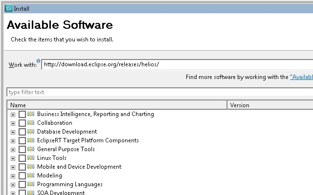
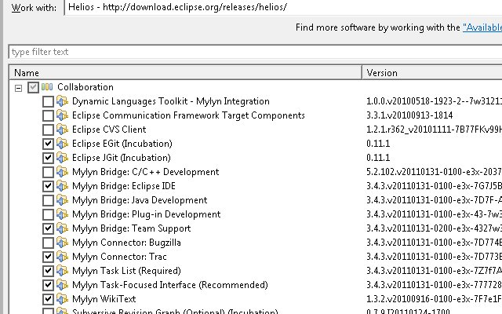

I downloaded an Adobe software package based on [Eclipse](http://www.eclipse.org/) for building web applications and installed it as standalone. The software package didn't contain a couple Eclipse tools I use for collaboration. This post will show how to add the latest Eclipse (Helios) update site and install Eclipse tools. These steps should work for any software packages based on Eclipse missing the Eclipse update site. I will be using [Adobe ColdFusion Builder 2](http://labs.adobe.com/technologies/coldfusionbuilder2/) beta and installing [Mylyn](http://www.eclipse.org/mylyn/) and [eGit](http://www.eclipse.org/egit/).

## Adding Eclipse Update site

On the Eclipse menu, select **_Help_** --> _Install New Software_ and an Install window should appear. In the "Work with:" field, paste in **_http://download.eclipse.org/releases/helios/_** and click **_Add_**.  An "Add Repository" window should appear with the Helios URL in the Location field. You can type Helios in the Name field and click _**OK**_. Eclipse will eventually display all the software available at the Helios update site. Tick off the tools you want and click **_Next_**. I am installing Mylyn and eGit.   Eclipse will chug along "Calculating requirements and dependencies" then if everything is ok, display an "Install Details" window. Click **_Next_**, accept licenses on Review Licenses windows, and click **_Finish_**. Eclipse will install the items and when complete, ask for you to "**_Restart Now_**",  "_Not Now_", or "_**Apply Changes Now**_". I usually select "Restart Now". Eclipse documentation does suggest after installing new software to run the clean argument. For this example, I would open the command prompt and run "**C:\\Program Files (x86)\\Adobe\\Adobe ColdFusion Builder 2 Beta\\CFBuilder.exe" -clean** to start Eclipse.
