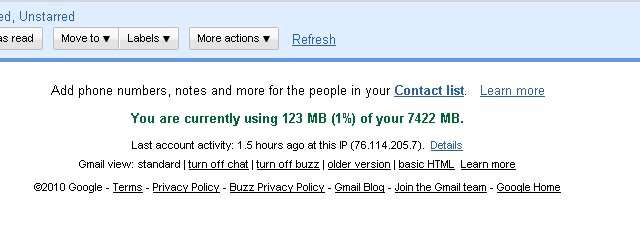
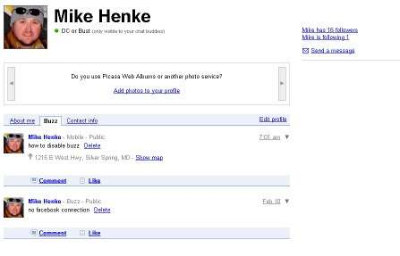
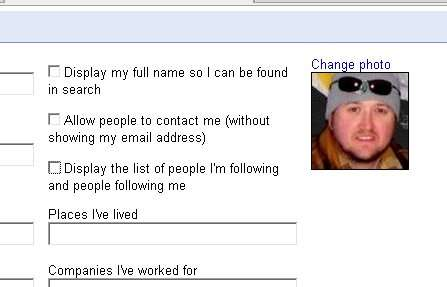

I recently was opted into a service I didn't sign up for. Many of you have been also. [Google Buzz](http://www.google.com/buzz) is Google's attempt at a social networking for "share updates, photos, videos, and more". What I find disturbing is Google opting me into a service, I didn't sign up for. Another irritating feature is Buzz has showed up when I check gmail. Finally, Google is touting "No setup needed. Automatically follow the people you email and chat with the most in Gmail" which I find invasive and potential for many issues. The first step is you may want to "turn off buzz" in your gmail account via a link on the bottom of your Inbox.  You may think this has turned off Buzz, but it simply turned off the Buzz feature from showing in your gmail account. Updates, comments, will continue to be shared. To really stop Buzz from what I have read in the [Buzz Privacy Policy](http://www.google.com/buzz/help/privacy.html), is to edit your [Google Profile](http://www.google.com/profiles). First, I deleted any buzz comments then unfollowed all the people it "automatically" added. I also unshared any items like twitter, flckr, etc.  Finally, I went to "Edit Profile" and unchecked the three options shown below.  I haven't found a way to really delete my Buzz account. I am not sure if people can still "follow" me and what updates they will receive.
