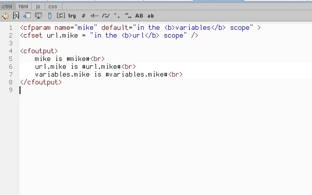
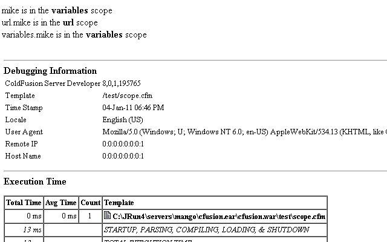
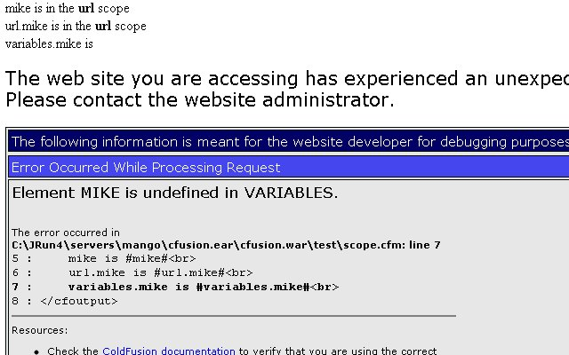

I thought an unscoped parameter when using [CFPARAM](http://help.adobe.com/en_US/ColdFusion/9.0/CFMLRef/WSc3ff6d0ea77859461172e0811cbec22c24-7faf.html) would be placed into the variables scope if the parameter didn't exist in the variables scope, similiar to [CFSET](http://help.adobe.com/en_US/ColdFusion/9.0/CFMLRef/WSc3ff6d0ea77859461172e0811cbec22c24-7ffd.html) when no scope is defined. Today I realized, CFPARAM doesn't always set an unscoped parameter to the variables scope. Here is a code example to explain better.

## Code Example

 So when you run this the page should see something like this.

## Code Results

 Everything Cool? Now, add to the url in the address bar **?mike=cool** and reload the page. Error, What happenned?

## Error Results

 Well, it seems **variables.mike** is undefined because CFPARAM is similar in regards to how ColdFusion [evaluates an unscoped variable](http://help.adobe.com/en_US/ColdFusion/9.0/Developing/WSc3ff6d0ea77859461172e0811cbec09af4-7fdf.html). CFPARAM tests for the existence of an unscoped parameter in _every scope_. Since in our error example, mike parameter is already defined, cfparam finds it and drives on. In the first example, mike parameter doesn't exist in any scope, so cfparam provides mike in the variables scope.
