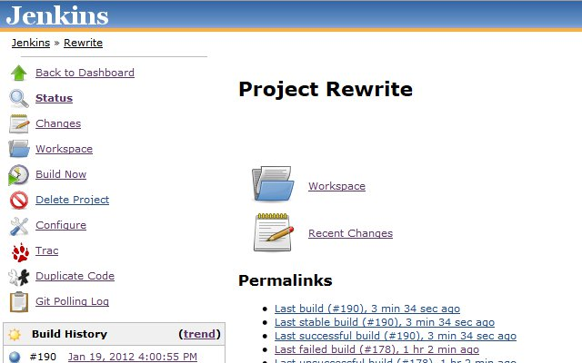
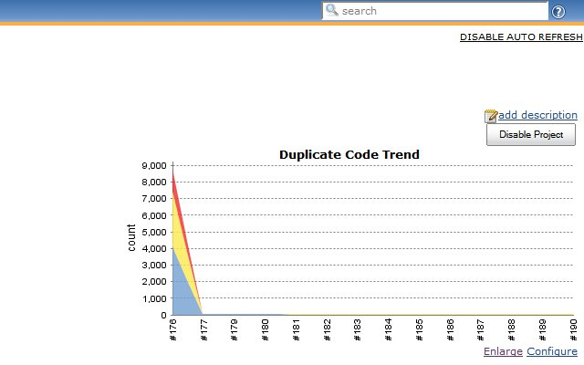
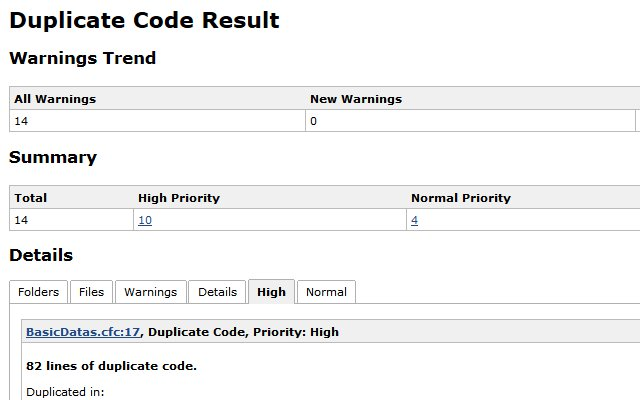
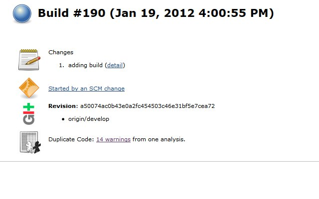
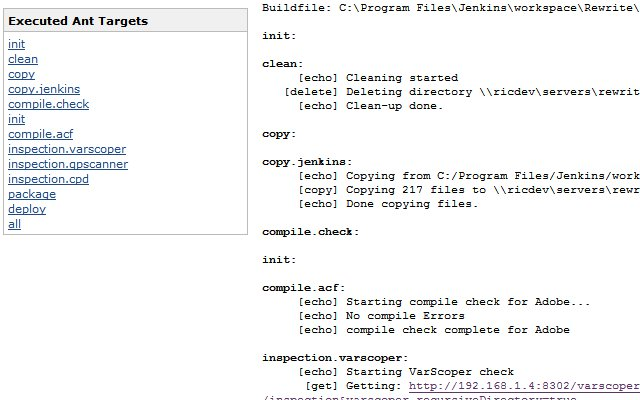
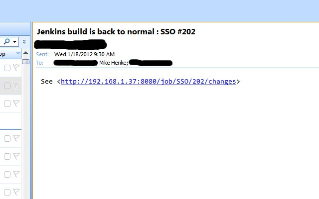
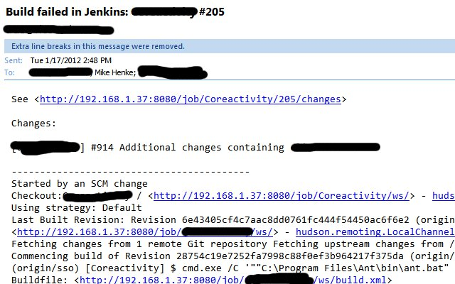
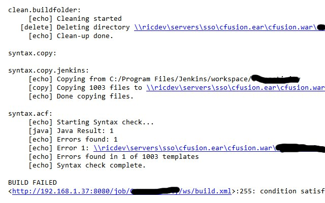

I have been implementing inspection of CFML code into some legacy and new projects. The [Cloudy with a Chance of Tests project](https://github.com/mhenke/Cloudy-With-A-Chance-Of-Tests) is designed in baby steps so anyone can use it without any changes to their code. The first step is inspecting the code's syntax locally. The next step would be starting to use a CI server. I have this step implemented. Then building unit tests and expanding the build.xml even more.  I haven't made the jump to unit testing but eventually will. It is really great to have a pulse of a project immediately even without unit tests. Here are screenshots of feedback from Cloudy with a Chance of Tests in the step I am on. Jenkins project page. Notice the build history, ticket system & source control integration, and duplicate code links.  This is a great way to keep a chart to keep tabs on the projects health by keeping it DRY.  The Dry plugin has reports to trace exactly what files and lines are being duplicated. These are ideal situations to dry the code thus making it more managable.  Here is an actual job page. The changes from source controll are easily accessable along with a duplicate code warning.  Here is the console output in Jenkins from the build. See the inspections and results here.  Adding alerts for builds is critcal so the developer can address issues immediately while they are recent. Here is an email of when a broken build is fixed and back to normal.  Here is an email from Jenkins on a build failure. You can see what change caused the problem  Along with what files are causing issues. 
