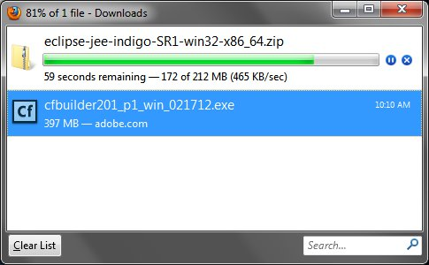
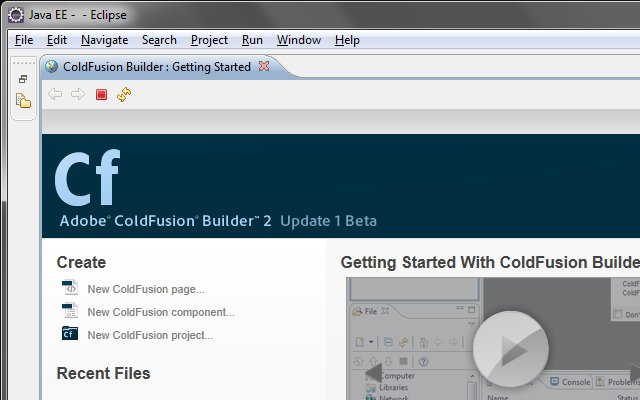
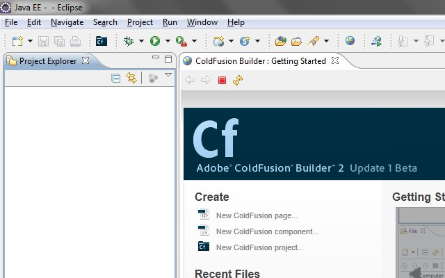
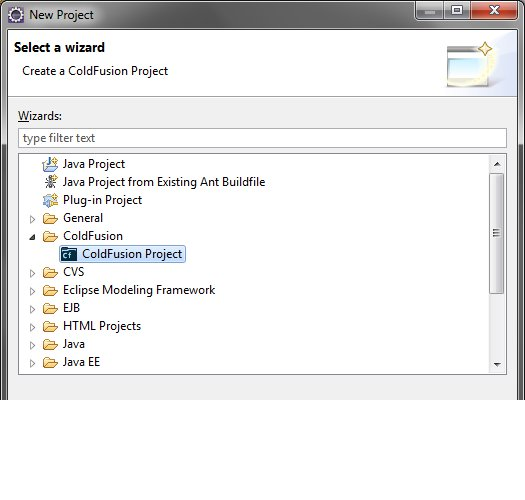
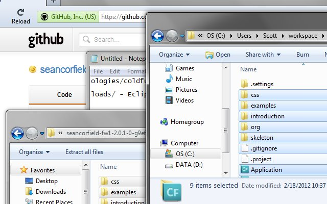
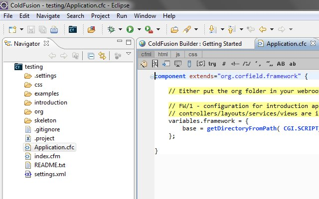
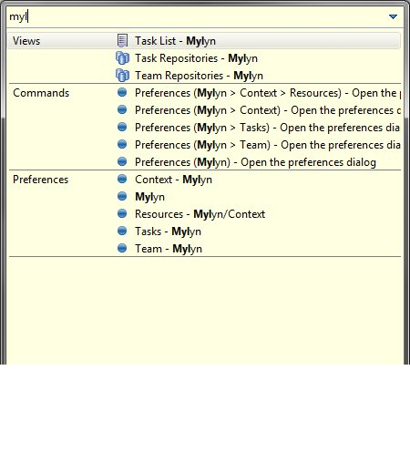
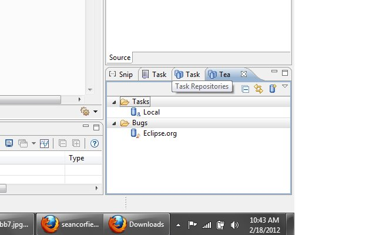
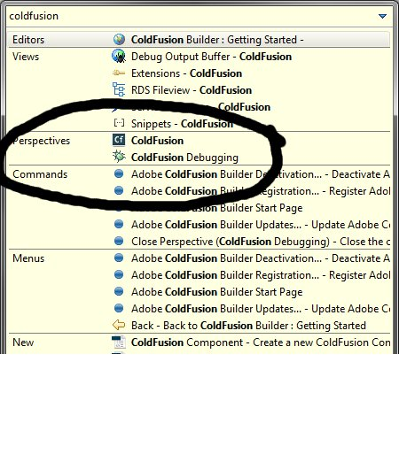

There was a tweet by [lolajl](https://twitter.com/#!/lolajl) about frustrations with installing [Mylyn](http://www.eclipse.org/mylyn/) on the CFBuilder2.0.1 beta. My recommendation was to skip trying the standalone then adding Mylyn. I would use [Eclipse](http://eclipse.org), then add CFB as a plugin. Below are the steps, I ran through when i installed CFB on Windows. 1) Download

- [ColdFusion Builder 2.0.1 beta](http://labs.adobe.com/technologies/coldfusion10/#coldfusion_builder)
- [Eclipse Indigo (3.7.1)](http://www.eclipse.org/downloads/) - Eclipse IDE for Java EE Developers- 64bit windows

 2) Unzip Eclipse

3. Start cfb installer, "run as administrator"

- next
- accept, next
- ColdFusion Builder plugins within Eclipse, next
- next
- this will be different, depending on your eclipse folder location, mine was C:\\Users\\Scott\\Desktop\\eclipse
- finish up wizard

noting the time to install cfb from starting installer to installation complete: 2 minutes 54 seconds

4. Start Eclipse, C:\\Users\\Scott\\Desktop\\eclipse\\eclipse.exe, open

first time opening eclipse, so select a workspace. this is where eclipse data is stored like projects.

\- C:\\Users\\Scott\\workspace

check use this as the default, ok 

arrange, views    and create new project. C:\\Users\\Scott\\workspace\\testing  
 5) lets grab some cfml files from github for testing CFB. using [fw1](https://github.com/seancorfield/fw1) since it is the most watched ColdFusion project.  
copy to project location (notice my project isn't linked to a cf server, this is just for testing cfb)  Refresh project in eclipse, open Application.cfc   
adding mylyn views to ColdFusion perspective

ctrl-3 - type "mylyn" in the quick access window 

select the three views, had to individual, couldn't highlight all three at once.

throws them somewhere, mine was lower right. 

once you have the perspective, setup how you like it, i recommend saving it as myXXXX so you can reset it easily.

Missing ColdFusion Perspective?  
control-3 then type in coldfusion 
