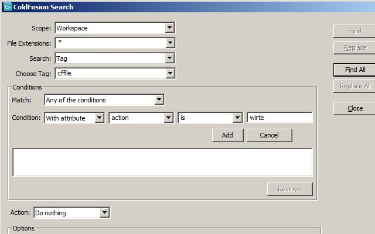

A cool feature of [ColdFusion Builder 2.0](http://www.adobe.com/products/coldfusion-builder.html) is the Advance ColdFusion Search with tags. This is pretty sweet for example today I wanted to find all the **cffile** tags with the action **write**. Let's open up the search, Search --> ColdFusion Search, to see what I am talking about. This is slightly different then normal Eclipse searches (ctrl-h). Once the window is open, you should see a field called Search. This is defaulted to Text, but lets select **Tag**. This resets the window and adds "Choose Tag" with a Conditions area. So continuing with my example, for "Choose Tag" select or type cffile. In the Conditions, leave Match as "_**Any of these conditions**_", leave Conditions as "_**With attribute**_", type or select _**action**_ in the next field, then _**is**_, and finally in the last input type "_**write**_". You should end up with something like this screenshot.  Select "Find All" and in the search view a list of all the cffile tags with the action of write will appear.
