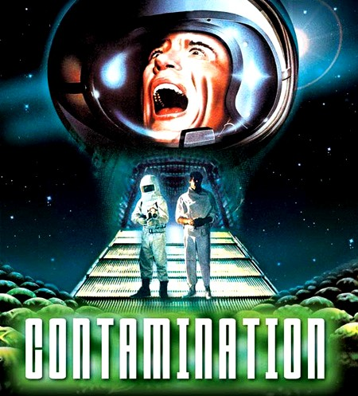

ColdFusion Builder Beta users should be aware when using ColdFusion Builder Extensions, the extension files/folders are being installed in a ColdFusion server's web root that the user selects. This may contaminate your web root with files and folders not relevant to your application releases. It may not be a big deal for you (SVN users could ignore the folders/files) but I would suggest creating a seperate ColdFusion server instance to house Extensions. Any thoughts? 
