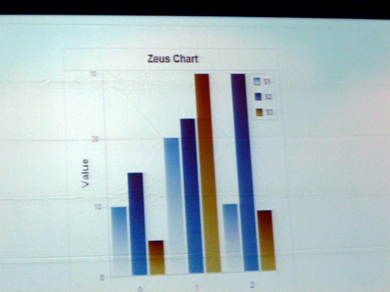

[CFObjective ANZ](http://www.cfobjective.com.au/) announced [a lot of cool news about ColdFusion](/coldfusion-news-from-cfoanz-keynote-twister-thunder-more). I am doing a series over these announcements. The first post was about upcoming improvements with [CFFile update and For in loop CFScript support of Queries](/coldfusion-language-improvements-content-within-cffile-and-for-in-loop-of-queries-in-cfscript). The next was [CFC improvements with implicit constructors, notation, and chaining](/coldfusion-language-improvements-implicit-cfc-constructors-notation-and-chaining). This will be over ColdFusion Server auto update feature, CFChart adding html format, and several Solr enhancements. **ColdFusion Server Updates** This Auto-Check feature has a lot of developers that manage their servers excited. It seems you can select automatically check for updates at every login, schedule update checks at set interval like daily, send email notification when updates are found, and even set up a local update site. It seems you can have updates installed automatically through Admin UI or manually execute hot fix installer jar downloaded.

|  |
| ------------------------------------------------------------------------------------------------------------------------------- |
| From [2011-11-18](https://picasaweb.google.com/henkemike/20111118?authuser=0&feat=embedwebsite)                                 |

**Charting Updates** Notice the format attribute can be set to html to generate a HTML chart.

|  |
| ------------------------------------------------------------------------------------------------------------------------------- |
| From [2011-11-18](https://picasaweb.google.com/henkemike/20111118?authuser=0&feat=embedwebsite)                                 |

HTML generated chart

|  |
| ------------------------------------------------------------------------------------------------------------------------------- |
| From [2011-11-18](https://picasaweb.google.com/henkemike/20111118?authuser=0&feat=embedwebsite)                                 |

Solr updates like directly index database, custom fields, reload collections individually, and hibernate support added.

|  |
| ------------------------------------------------------------------------------------------------------------------------------- |
| From [2011-11-18](https://picasaweb.google.com/henkemike/20111118?authuser=0&feat=embedwebsite)                                 |
