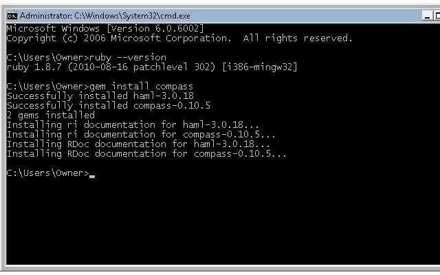
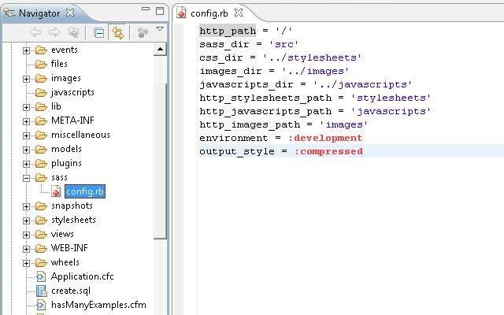
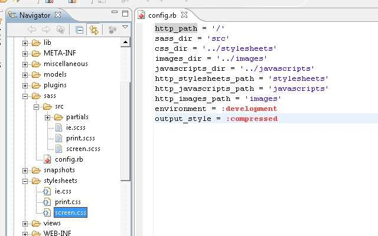
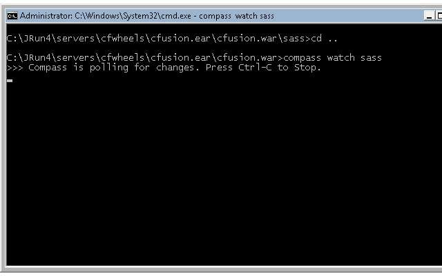

I will be showing how to setup [Compass](http://compass-style.org/ "http://compass-style.org/") and [Sass](http://sass-lang.com/ "http://sass-lang.com/") to create better, more maintainable stylesheets for [ColdFusion](http://www.adobe.com/products/coldfusion/) programmers.  This will include installing [Ruby](http://www.ruby-lang.org/en/) and a ruby gem (library package). We won't be coding Ruby, just leveraging one of its many libraries. This idea was inspired by Rob Wilkerson's [Compass, SASS, CakePHP post.](http://weblog.robwilkerson.org/post/1131885328/compass-sass-cakephp "http://weblog.robwilkerson.org/post/1131885328/compass-sass-cakephp")

## What is Compass and Sass

_"**Compass** is a stylesheet authoring framework that makes your stylesheets and markup easier to build and maintain. With compass, you write your stylesheets in Sass instead of CSS."_

 

"_With \*\*\_compass_**, you write your stylesheets in Sass instead of _CSS_. Using the power of Sass Mixins and the _Compass_ community, you can apply battle-tested\_ **_..._"\*\*

 

_"**Sass** is a meta-language on top of CSS that’s used to describe the style of a document cleanly and structurally, with more power than flat CSS allows. Sass both provides a simpler, more elegant syntax for CSS and implements various features that are useful for creating manageable stylesheets."_

 

_"\*\*\_Sass_\*\* makes CSS fun again. _Sass_ is an extension of CSS3, adding nested rules, variables, mixins, selector inheritance, and more. ...\_"

## Overview of Process

I will be showing how to setup Compass on ColdFusion 8, JRun4, and Vista. The general process should be similar for other configurations and operating systems.

### The process is per system:

1. Install Ruby
2. Install Compass

### For each project using Compass, we will:

1. Create a Sass folder with a configuration file
2. Optional - Install blueprint (you could use [YUI Compass Plugin](http://github.com/chriseppstein/yui-compass-plugin) or nothing for a starting point)
3. Compile our Sass files to CSS (this can be manual or automated)

## Detailed Process

First, you will need to grab and install Ruby. [http://www.ruby-lang.org/en/downloads/](http://www.ruby-lang.org/en/downloads/ "http://www.ruby-lang.org/en/downloads/") under "Ruby on Windows" said our first option was using the RubyInstaller [http://rubyinstaller.org/downloads/](http://rubyinstaller.org/downloads/ "http://rubyinstaller.org/downloads/") so I went there and downloaded Ruby 1.8.7-p302 under RubyInstallers. After installing, check to see if Ruby is there.  In the Command Prompt type: ruby --version

 

Step 1 done. Now to install Compass. With the Command Prompt still open type: gem install compass

Step 2 done.

 

These steps will only be done once on each system you want to use Compass and Sass. Since Compass will generate our CSS, we don't need to install this on environments like Production. In source control system, I would track the Sass and generated CSS files. In the build process just ignore the Sass files.

 

Now for the big finale, 1) we will setup a configuration file, 2) install Blueprint for a project, and 3) start a watcher (this will automate the compiling of our css). 

 

1. Open your editor of your choice. I am using Eclipse 3.6 with [ColdFusion Builder](http://www.adobe.com/products/coldfusion/cfbuilder/features/). The project for me is a typical [CFWheels](http://cfwheels.org/docs/1-0/chapter/directory-structure) file/folder structure but don't concern yourself with all the files/folders. In the webroot create a folder called SASS and add a file called config.rb. Paste in this code in the config.rb file:

 

\[code language="coldfusion"\]
http_path = '/'
sass_dir = 'src'
css_dir = '../stylesheets'
images_dir = '../images'
javascripts_dir = '../javascripts'
http_stylesheets_path = 'stylesheets'
http_javascripts_path = 'javascripts'
http_images_path = 'images'
environment = :development
output_style = :compressed
\\[/code\]

 

The lines you may need to modify are the css_dir, images_dir, and javascript_dir to match your folder structure. Notice it is a relative path from the location of config.rb file http_stylesheets_path, http_javascripts_path, and http_images_path are the url path to these folders.

 

2. Optional - (you could use [YUI Compass Plugin](http://github.com/chriseppstein/yui-compass-plugin) or nothing as a starting point)

In the Command Prompt type in the path to your webroot and the sass folder you created. For me it is "C:\\JRun4\\servers\\cfwheels\\cfusion.ear\\cfusion.war\\sass".

Type in and run: compass install blueprint/semantic

 

You will see some stuff flash by the screen. Check your editor, you will need to refresh in Eclipse. You should see a src folder in your sass folder along with some compiled css files in your stylesheet location. Feel free to check out the scss files used to generate the stylesheets.

 

3. Drop down one directory in your command prompt, so you are in your webroot and type in: compass watch sass

## This is just a starting point, now start exploring using Sass :-)

Now you are set to start using Sass. For more on using Sass, just google it.  Here are some materal I have found.

 

Screencasts:

[An introduction to Compass](http://compass-style.org/docs/)

[Compass: A Real Stylesheet Framework](http://vimeo.com/4335944)

[#88: Intro to Compass/Sass](http://css-tricks.com/video-screencasts/88-intro-to-compass-sass/)

 

Blog Entries:

[Trying out Compass, a CSS Framework](http://www.neverfriday.com/sweetfriday/2009/05/trying-out-compass-a-css-frame.html)

[Using Compass and Sass for CSS in your Next Project](http://net.tutsplus.com/tutorials/html-css-techniques/using-compass-and-sass-for-css-in-your-next-project/)
