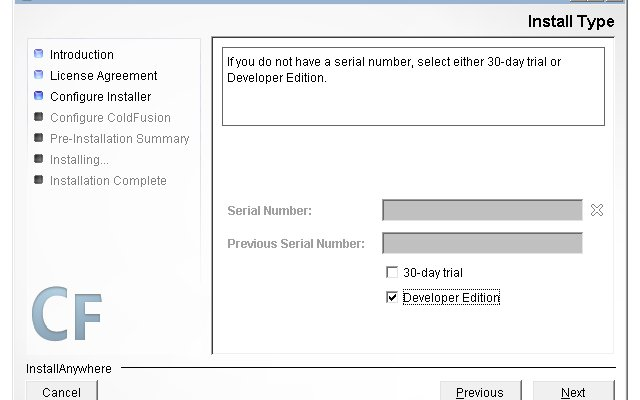
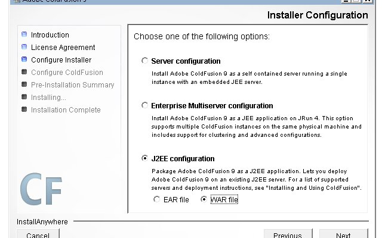
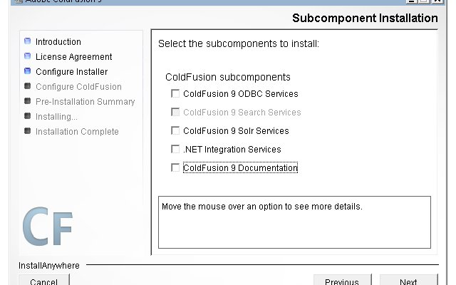
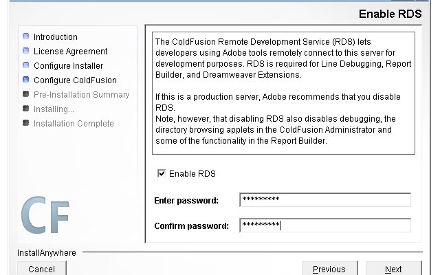
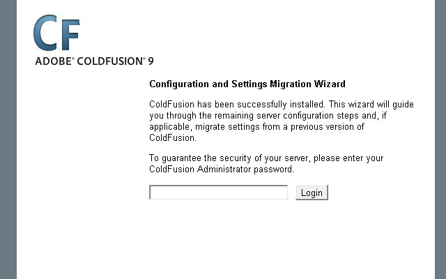
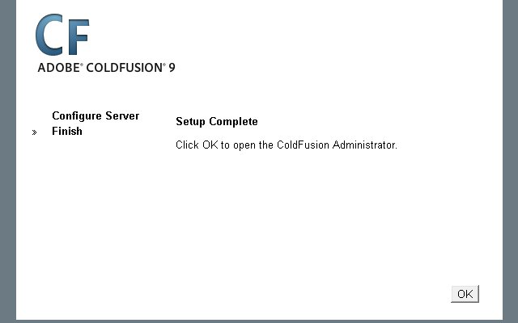
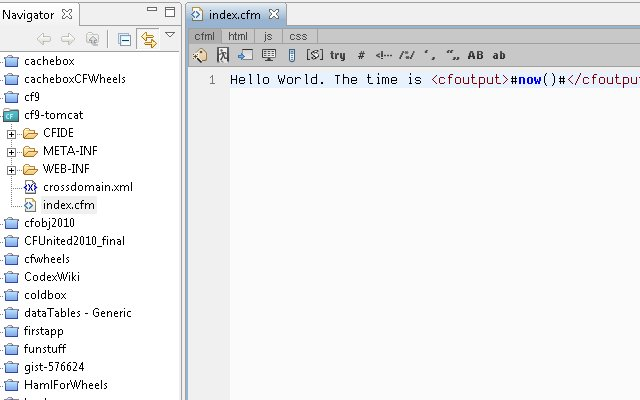

[Jamie Krug](http://jamiekrug.com/blog/) had a great opening presentation on "[Complete FOSS CFML Developer Stack](http://www.opencfsummit.org/index.cfm/schedule/sessions/complete-foss-cfml-development-stack/)" for the [OpenCF Summit](http://www.opencfsummit.org/). [FOSS](http://en.wikipedia.org/wiki/Free_and_open_source_software) stands for free and open-source software. Jamie used Ubuntu, MySQL/PostgreSQL, Apache, Tomcat, [OpenBD](http://www.openbluedragon.org/)/[Railo](http://www.getrailo.com/), [CFEclipse](http://www.cfelcipse.org), and [Git](http://git-scm.com/). He mentioned you could use any OS like Windows or Mac for the stack. Technically, this would probably not be called FOSS then. So if we take swapping out pieces another step, we could switch out the cfml engine and/or the cfml editor with [Adobe ColdFusion (ACF) server](http://www.adobe.com/products/coldfusion/) and [ColdFusion Builder](http://www.adobe.com/products/coldfusion/cfbuilder/features/) (CFBuilder). The developer’s edition of ACF I’ll be using is free. I’ll also be using CFBuilder for editing any code in this blog post. I’ll walk through how to create a war using ACF9 and drop it in Tomcat like Jamie demonstrated with Railo and OpenBD. If you don’t have Tomcat and Apache installed, [Matt Woodward has an awesome blog post on it](http://www.mattwoodward.com/blog/index.cfm?event=showEntry&entryId=03233F6F-ED2C-43C7-AFF5FA2B3C3D845B). The process for ACF is three step: 1) create a war file via the installer. 2) drop the war in Tomcat 3) Finish the installation process via the browser.

## Creating the war

1. Start the ACF9 installer. I’ll show the installer steps where I changed the defaults.     And when I finish, the installer will create a war file in C:\\ColdFusion9 . 

## Renaming and moving the war to Tomcat

I copied and renamed the cfusion.war located at C:\\ColdFusion9 to cf9.war. Next I copy the cf9.war into my Tomcat webapps folder.

## Finishing installation

I started my Apache and Tomcat instance and ran http://localhost:8080/cf9/CFIDE/administrator/  

## Testing installation

Now, to test I’ll use CFBuilder to create an index.cfm page. I created a project at C:\\Program Files\\Apache Software Foundation\\Tomcat 6.0\\webapps\\cf9 and then an index.cfm with: Hello World. The time is <cfoutput>#now()#</cfoutput>.  And test the page at http://localhost:8080/cf9/index.cfm

## Conclusion

Now you have an un-FOSS stack with ACF similar to what Jamie presented at OpenCF Summit. If you work through Matt’s post, you can actually make the url more friendly. Jamie did mention to me ACF9’s war is missing some jar for ORM Tomcat is missing some jars and [Bob Silverberg has a post about resolving it](http://www.silverwareconsulting.com/index.cfm/2009/8/28/Using-CF9s-ORM-Features-Under-Tomcat).
