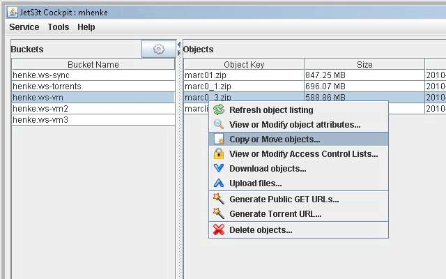
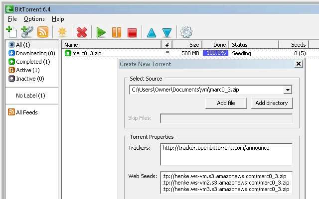

I have been venturing into creating and distributing torrents for ColdFusion related downloads like [MARC 0.3](http://mikehenke.com-torrents.s3.amazonaws.com/marc0_3.torrent) (MySQL, Apache, [Railo](http://www.getrailo.com/), and [ColdFusion On Wheels](http://www.cfwheels.org/)) virtual machine. I decided on using my website and [Amazon Simple Storage Service](https://s3.amazonaws.com) (Amazon S3) to host the actual files the torrent will use.

### Torrent Vocabulary

A _Web Tracker_ is a server that keeps track of which seeds and peers are in the swarm. A _seeder_ is a peer that has a complete copy of the torrent and still offers it for upload. A _Web seed_ is an http or ftp sever that makes the file available for download. An _Announcment_ tells the Web Tracker, it should add this download to the list of peers in the swarm. A _swarm_ is all peers (including seeders) sharing a torrent are called a _swarm_ Some definitions are from [http://en.wikipedia.org/wiki/BitTorrent_vocabulary](http://en.wikipedia.org/wiki/BitTorrent_vocabulary).

### Web Tracker

I am using [OpenBittorrent](http://openbittorrent.com/). The announcement url is http://tracker.openbittorrent.com/announce .

### Creating the Web Seeds

I will be using my site and Amazon S3 so I uploaded the files using [FileZilla](http://filezilla-project.org) and [Jets3t Cockpit](http://jets3t.s3.amazonaws.com/applications/applications.html). The initial upload may take awhile into Amazon S3 . If you have multiple Amazon S3 buckets, the subsequent copy and move option in Jets3t Cockpit will speed up the process.  I use [S3Fox](http://www.s3fox.net/) plugin to control access to the files on Amazon S3. Make sure the access is read. Now we have the web seeds ready and will create the torrent.

### Creating the torrent

I am using [BitTorrent](http://www.bittorrent.com) to create the torrent. Creating the torrent using BitTorrent is very straight forward (File --> Create New Torrent). You will need to select where the file is located on your computer then provide a tracker and any web seeds you created. Next select "Create and save as".  Now you will be prompted to save the torrent file you will distribute to people. Once saved, you can upload the torrent to where you want people to download it from. You can use Amazon S3 to create a torrent while convenient (all you do is add ?torrent to the end of the url to the file) seems limited. I haven't figured out a way to include other web seeds to this torrent.  It uses an amazon web tracker for announcements.

### Distributing the torrent

I uploaded the torrent to Amazon S3 since my site doesn't seem to allow download of torrent files and provided the url to people. You can also email the torrent or pass it around on your thumb drive.
