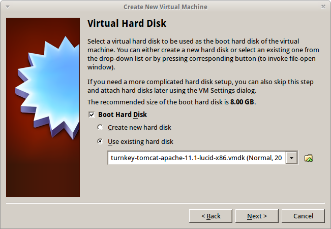
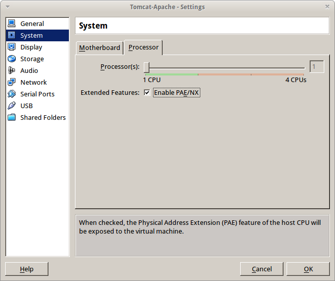
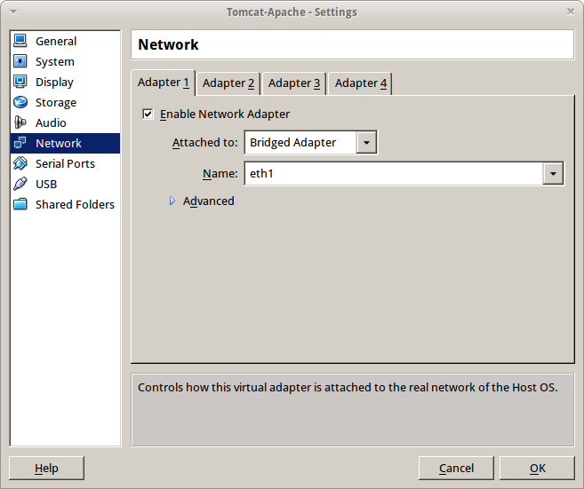
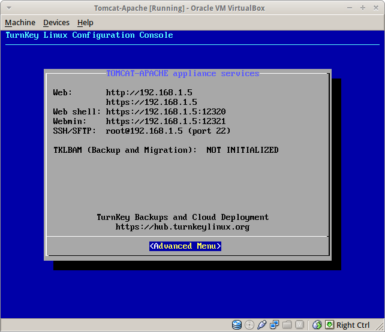
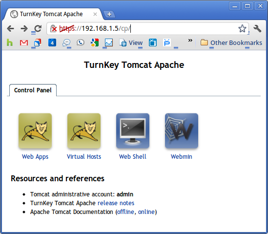
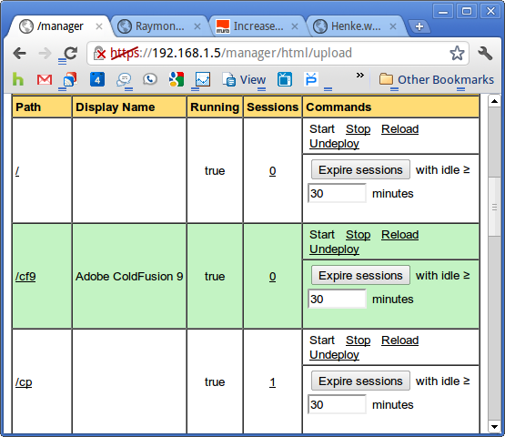
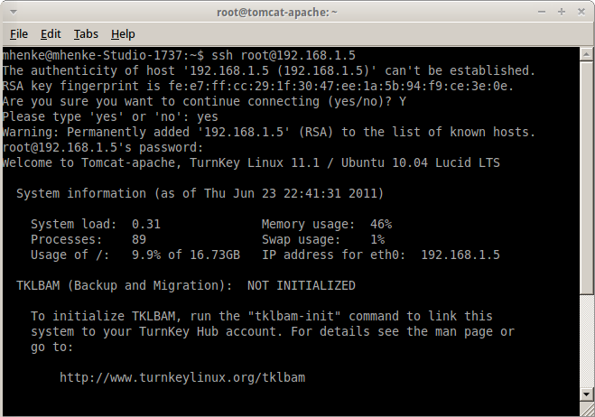
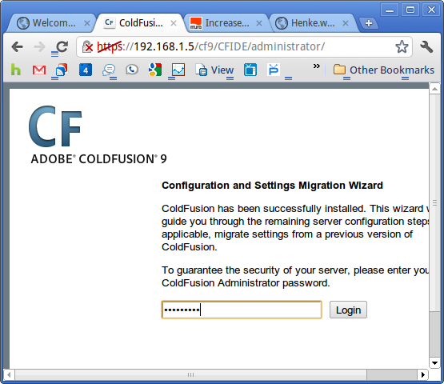
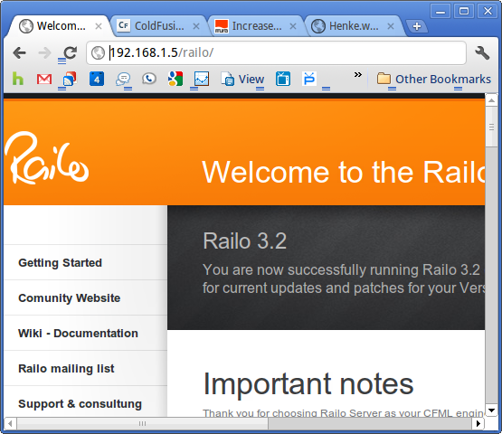
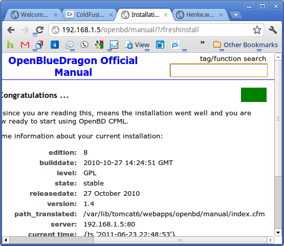

This post is a combination of several posts and shows how to setup [Turnkey](http://www.turnkeylinux.org/) Tomcat Apache's virtual box with different [ColdFusion](http://en.wikipedia.org/wiki/ColdFusion) engines.  "Turnkey Linux is a virtual appliance library that integrates and polishes the very best open source software into ready to use solutions. Each virtual appliance is optimized for ease of use and can be deployed in just a few minutes on bare metal, a virtual machine and in the cloud."  [More](http://www.turnkeylinux.org/about) Here are the posts I referenced when writing this one.

- [http://www.packtpub.com/article/develop-php-web-applications-netbeans-virtualbox-turnkey-lamp-appliance](http://www.packtpub.com/article/develop-php-web-applications-netbeans-virtualbox-turnkey-lamp-appliance)
- [http://www.atentia.net/2011/02/turnkey-linux-getting-my-app-running-on-tomcat-easy-wa/](http://www.atentia.net/2011/02/turnkey-linux-getting-my-app-running-on-tomcat-easy-wa/)
- [http://www.turnkeylinux.org/docs/installation-appliances-virtualbox](http://www.turnkeylinux.org/docs/installation-appliances-virtualbox)

## Download / Install VirtualBox and Turnkey VM

Go to the VirtualBox Web site and download the most recent version: [http://download.virtualbox.org/](http://download.virtualbox.org/) After downloading VirtualBox, install it:

- Go to the Turnkey Linux Web site and download the Tomcat-Apache appliance: [http://www.turnkeylinux.org/tomcat-apache](http://www.turnkeylinux.org/tomcat-apache)
- Unzip Turnkey and you should see three files: txt, vmdk, and vmx

## Create a virtual machine

- Open VirtualBox and click on the New button to create a virtual machine (VM)
- In VirtualBox, launch the VM creation wizard by clicking the New button
- OS Type: Select Linux / Ubuntu as your operating system
- Virtual Hard Disk: Select "use an existing hard disk", navigate to the directory where you extraced the ZIP, and select the VMDK hard disk image

## BASIC VM CONFIGURATION

After you've created the new VM, you'll need to tweak its configuration before starting it:

- Settings > System > Processor > Enable PAE/NX
- PAE: This is required as the linux-virtual kernel in the VM optimized images uses PAE to allow addressing of more than 4GB of memory.
- NX: refers to the CPU feature required by VirtualBox to support PAE. All new CPUs support NX but some older ones may not.

- Settings > Network > Adapter 1 > Attach to: bridged
- Bridging your VM connects it to the local network your host machine is on.

Now start your virtual appliance for the first time. Once started, fill out the passwords for root, tomcat, and mysql. Yeah, turnkey even has a db setup for you. On security updates, I said install. This may take awhile. Once fully updated and ready, you should see this.  Deploy Wars Download the ColdFusion server instances, we'll use [Adobe](http://www.adobe.com/products/coldfusion/), [Railo](http://www.getrailo.com/), and [OpenBD](http://www.openbluedragon.org/). Adobe unlike the others makes you create your war via the installer. Once you have the 3 wars, upload them using the Tomcat Manager. I renamed the wars, cf9, railo, and openbd. Go you Web address, mine is https://192.168.1.5 then select the Tomcat Web Apps link and sign in. Click through the security warning.  Go to the WAR file to deploy section, Choose File and Deploy. Repeat for each war. When completed you should see the  3 ColdFusion engines running and the path the name of the war like this picture with cf9 in the path column. 

## Configure Apache

https://192.168.1.6:12320/ or from the command prompt ssh to our vm. I am going to show this with ssh so I can copy/paste.  Run this command: **_nano /etc/tomcat6/mod_jk.conf_** Paste/Type in this at the end of the file: **_JkMount /cf9 ajp13_worker_** **_JkMount /cf9/\* ajp13_worker_** **_JkMount /railo ajp13_worker_** **_JkMount /railo/\* ajp13_worker_** **_JkMount /openbd ajp13_worker_** **_JkMount /openbd/\* ajp13_worker_** Exit the file but first save it using: ctrl-o to save and ctrl-x to exit Then reset Apache by running this command: **_/etc/init.d/apache2 restart_**

## Testing our ColdFusion Engines

Now try your CF engines like http://192.168.1.5/railo or https://192.168.1.5/openbd . For ACF9, you'll have to go to http://192.168.1.5/cf9/CFIDE/administrator/ and finish the ACF installation process.    Next post, I'll show how to hookup Eclipse to our new virtual CF servers and start developing code.
