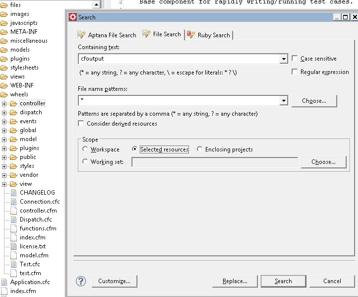

I use the [Eclipse](http://www.eclipse.org) search and find capabilities quite a bit during the day. If you are using [CFEclipse](http://www.cfeclipse.org) or [CFBuilder](http://www.adobe.com/products/coldfusion/cfbuilder/features/) the Eclipse basics should be the same. [Eclipse documentation](http://help.eclipse.org/helios/index.jsp?nav=/0_1) is a great resource and should be looked at when using CFBuilder or CFEclipse. I will talk about the differences between Eclipse Find and Eclipse Search.

## My definitions of Find and Search

I define "find" as searching an already open document that has my focus, meaning if I click some where else outside of the editor tab like the Navigator view, I won't have the option to do a find (ctrl-f). If I click back into my editor, ctrl-f is available to search the opened document. I define "search" as searching resources that may or not be open. I could search a folder, my whole workspace, a subset of files, or even a subset of a search results (I'll show that at the end of this post).

## Eclipse Find/Replace

For simple finds, the default ctrl-f is great. I have seen some plugins enhance the find and it still does what I want which is "search" the document I am in, without a lot of thought from me. It should be simple and effective. Here is the out of the box Eclipse find: 

## Eclipse Search

The default Eclipse search works great for me also. I usually click the flashlight icon but need to start using ctrl-h more. Here is a picture of when I open the Eclipse search page. 

### Customizing the Search page

Notice three tabs in my Search page abobe. Each tab is a specialized search. Depending on your Eclipse package and plugins, you may have more or less tabs. You can "customize" the Search page by selecting the "customize" button. Deselect a search from the Search Page Selection and the search won't appear in the search page (ctrl-h or the flashlight icon).

| Search Page Selections from my [RadRails](http://aptana.com/products/radrails) installation  | From my [Eclipse JEE Helios Windows 32](http://www.eclipse.org/downloads/download.php?file=/technology/epp/downloads/release/helios/SR1/eclipse-jee-helios-SR1-win32.zip) installion  |
| -------------------------------------------------------------------------------------------------------------------- | ------------------------------------------------------------------------------------------------------------------------------------------------------------------------------------------------------------- |

## Search Results

Here is an example of a search using "selected resources" then using the search results for a different search. I select a folder in my Navigator view, then open the Eclipse search page (ctrl-h or the flashlight icon), and select the "File Search" tab, and entered my text, making sure "selected resources" was ticked, and finally click the "Search" button 

### Search View

My Search page disappeared but a Search view appeared with my results. Now to search those results, I select all the results in the Search view, and re-search using ctrl-h or the flashlight icon.  Finally I have my results from the second search of my first search. 

## Conclusion

Please checkout all the different specialized searching Eclipse and Eclipse plugins give you. Here is a [Basic tutorial](http://help.eclipse.org/helios/advanced/print.jsp?topic=/org.eclipse.platform.doc.user/gettingStarted/qs-01.htm) under the Workspace -> Getting Started section of the Eclipse documentation. It is definately a must read for new and old Eclipse users. A sub section of the tutorial even covers the [Eclipse Search](http://help.eclipse.org/helios/index.jsp?topic=/org.eclipse.platform.doc.user/gettingStarted/qs-36.htm) in more detail. Read up and enjoy all Eclipse built-in features and the enhanced features plugins add like CFBuilder and CFEclipse.
