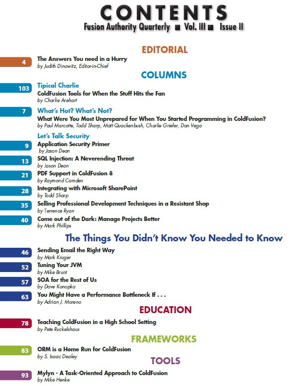

I read Jason Dean's "[The new Fusion Authority Quarterly Update is out](http://www.12robots.com/index.cfm/2010/1/5/The-new-Fusion-Authority-Quarterly-Update-is-out)" post and found out the latest FAQU was released. The FAQU is a well edited and researched [ColdFusion](http://en.wikipedia.org/wiki/ColdFusion) publication. There is alot of free material/knowlegde available on the web but FAQU is worth the nominal subscription fee. Please [subscribe](https://secure.houseoffusion.com/Vol3Issue2.cfm) to support their high quality effort and read my article "[Mylyn](http://www.eclipse.org/mylyn/) - A Task-Oriented Approach to ColdFusion." 
