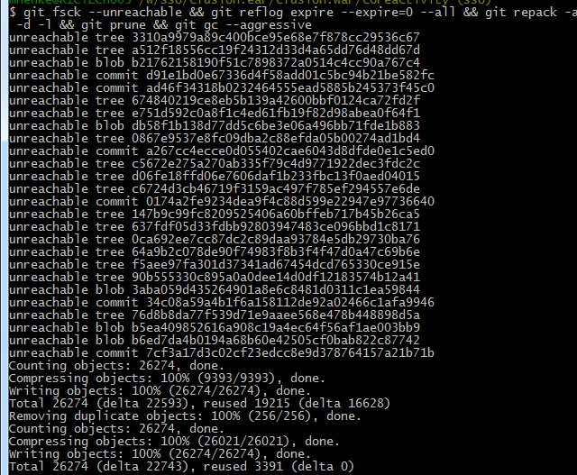

I blogged about "[Git Performance Commands](/git-performance-commands)" before. Basically these commands are spring cleaning for your git repository. I run them occasionally at work. I love chaining git commands together so here are the commands chained. **git fsck --unreachable && git reflog expire --expire=0 --all && git repack -a -d -l && git prune && git gc --aggressive** Here is what it looks like ran in the git bash. 
