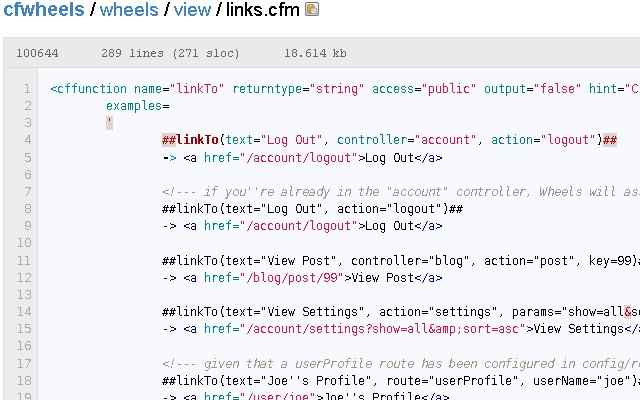

[Github](http://www.github.com) now tracks [CFML](http://en.wikipedia.org/wiki/ColdFusion_Markup_Language) syntax. Github uses [Pygments](http://dev.pocoo.org/projects/pygments), a generic syntax highlighter.  Pygment recently added support for CFML and Github has implemented it.

### What does this mean to the ColdFusion community?

Github recognizing ColdFusion means more exposure. Currently [ColdFusion is the 32nd most popular language on Github](http://github.com/languages/ColdFusion).  [PHP is the 7th](http://github.com/languages/PHP). I would love to see more of the ColdFusion community migrating open source projects to github. Snapshot from [http://github.com/rip747/cfwheels](http://github.com/rip747/cfwheels) 

### What is Git and Github?

"Git is a fast, efficient, distributed version control system ideal for the collaborative development of software.  
GitHub is the easiest (and prettiest) way to participate in that collaboration: fork projects, send pull requests, monitor development, all with ease." - text from [http://github.com](http://github.com)

### What about Riaforge?

[Riaforge](http://www.riaforge.org) should still be the centralized place to find and showcase open source project built on Adobe technology but the source code and [issue tracker should reside on Github](http://github.com/blog/411-github-issue-tracker).  Similiar to projects using Google Code. [CFGithub](http://cfgithub.riaforge.org/) is an example of a Riaforge project using Github.

### Getting Started

There is plenty of information on the web about using git and github.

### More Information

[Git, Github, ColdFusion, and Open Source](http://coldfusiondarklord.com/git-github-coldfusion-and-open-source) [Why Git Hub](http://winterdom.com/2008/08/whygithub) [Why GitHub Will Overtake SourceForge](http://www.pjhyett.com/posts/232-why-github-will-overtake-sourceforge) [Why Github and Friends Matter](http://www.smerpology.org/sprocket/article/1258/why-github-and-friends-matter)
