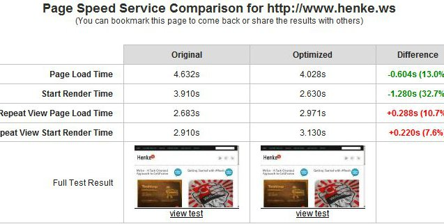
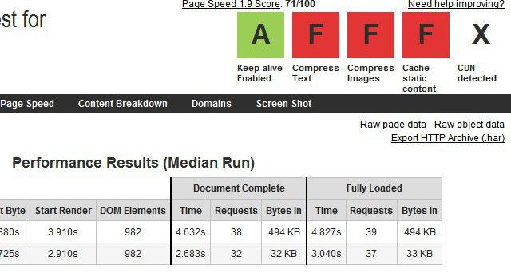
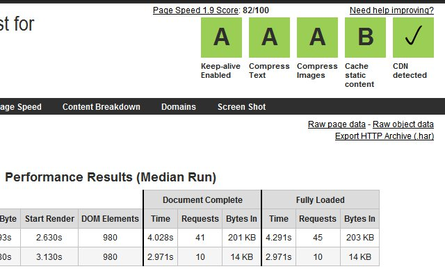
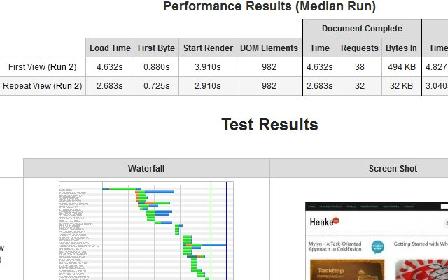
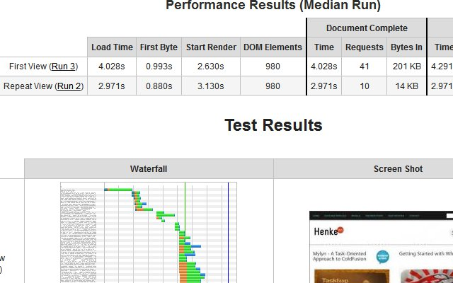

During my morning Google Reader review, I noticed a couple posts on [Google Page Speed Service](http://code.google.com/speed/pss/) ([Page Speed Service: Web performance, delivered](http://googlecode.blogspot.com/2011/07/page-speed-service-web-performance.html) and [Will You Use Google’s New Page Speed Service?](http://www.sitepoint.com/google-page-speed-service) ) so I decided to run the [comparison test](http://www.webpagetest.org/) against Henke.ws. It is a simple blog site using [MangoBlog](http://www.mangoblog.org/) and [ColdFusion](http://en.wikipedia.org/wiki/ColdFusion). Here are the test results.  Below is the current page speed scorecard.  This is the Google Page Speed service scorecard.  This is the current page performance results.  This is the Google Page Speed service performance results. 

## Conclusion

I filled out [the form to try the service](https://docs.google.com/a/google.com/spreadsheet/viewform?hl=en_US&formkey=dDdjcmNBZFZsX2c0SkJPQnR3aGdnd0E6MQ). The real saving was compression of the document from nearly 500 kb to 200 kb and requests from repeated views (32 to 10). Suprisingly repeated load times, seemed to decrease but first view was slightly faster. The [full results](http://www.webpagetest.org/result/110729_65_b9af2a0b62794b475085c12c42190db0/) are here for you to review and dig through. The Visual Comparison is pretty wicked.
