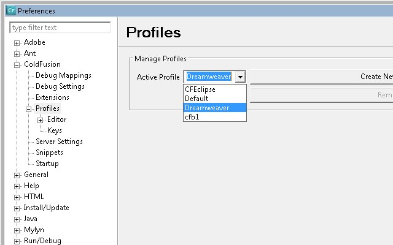
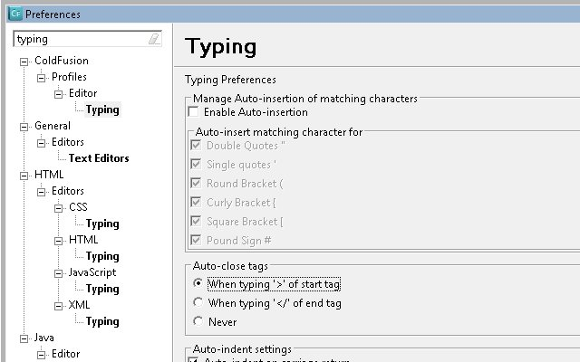

I have a friend who emailed me last night after downloading [a public beta](http://labs.adobe.com/technologies/coldfusionbuilder2/) for Adobe's second generation of an IDE based on [Eclipse](http://www.eclipse.org) which enables developers to rapidly build, deploy, and maintain robust Internet applications for the enterprise. He had two gripes: Key Assists and Auto-closing tags. I'll show how to turn the Eclipse based IDE he downloaded into a more Dreamweaver like experience. Go ahead, [download and install ColdFusion Builder 2](http://www.adobe.com/cfusion/entitlement/index.cfm?e=labs_coldfusionbuilder2) so you can walk through these steps with me. _**UPDATED:**_ _The installation can be as an Eclipse plugin or standalone._ Please forgive me since I haven't used Dreamweaver in years, so feel free to contribute comments on other ways you make Eclipse more like Dreamweaver.

## Key Assists

Under the Window --> Preferences --> ColdFusion --> Profiles, select Dreamweaver. That is it. Now you should have Dreamweaver shortcuts and even color coding. 

## Auto-closing Tags

Eclipse's preferences are sometime hard to find settings. With the Preferences window still up type "Typing" in the filter and select Typing under ColdFusion --> Profiles --> Editor. On the Typing panel, under Auto-close tags select "When typing '>' of start tag". Then repeat this general process for the other Typing panels under HTML.  This concludes my post about how to make Eclipse more like Dreamweaver.
