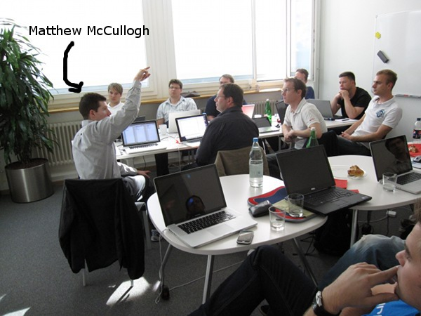

[Why Git? Why Change? - The Online ColdFusion Meetup (Alpharetta, GA) - Meetup](http://www.meetup.com/coldfusionmeetup/events/24888341/) _**Mark your calendar for July 21st 6pm ET**_, [Matthew McCullogh](https://github.com/matthewmccullough) will be presenting at the [Online ColdFusion Meetup](http://www.meetup.com/coldfusionmeetup/). He is a Git Rockstar/Trainer with regular [1 day courses](https://github.com/training/online) and [O'Reilly training videos](http://oreilly.com/catalog/0636920017462/).

## Title: Why Git? Why Change?

## Description

A new wave of version control systems is sweeping the development community. They are grouped under the heading of \*distributed version control systems\* or DVCSs for short. The three prominent DVCS names are Bazaar, Mercurial and Git. But which one should you choose? I'll show you specifically what Git has to offer above and beyond its cousins in this 50 minute session. Your appetite for Git will be thoroughly whet through examples of how to think in terms of the very expanded capabilities that Git provides. This session will be filled with live demonstrations and thoughtful diagrams to make Git make sense. You'll walk away inspired to use Git for both your current and upcoming projects.

## Bio

Matthew McCullough is an energetic 15 year veteran of enterprise software development, open source education, and co-founder of Ambient Ideas, LLC, a U.S. consultancy. Matthew currently is a trainer for GitHub.com, author of the Git Master Class series for O'Reilly, speaker on the No Fluff Just Stuff tour, co-leader of Gradleware training, author of three of the top 10 DZone RefCards, and President of the Denver Open Source Users Group. His current topics of research center around project automation: build tools (Gradle, Maven, Leiningen), distributed version control (Git), Continuous Integration (Jenkins, Hudson) and Quality Metrics (Sonar). Matthew resides in Denver, Colorado, USA with his beautiful wife and two young daughters, who are active in nearly every outdoor activity Colorado has to offer.
