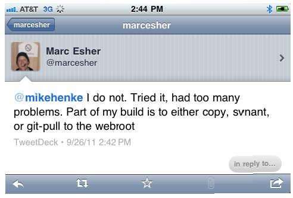

In down time, I am working on setting up [Jenkins](http://jenkins-ci.org/) at work. I have Jenkins, [Git](http://git-scm.com/), and [Ant](http://ant.apache.org/) playing nice. The next step was figuring out how to move the files to our ColdFusion server. My first inclination was to point the Jenkin's job workspace to the webroot. I asked on twitter [@marcesher](http://twitter.com/marcesher) about that. His reply was very helpful.  So I figured the second easiest would be to create a shared drive and use ant to copy the files from the Jenkin job's workspace. This seems to work fine. I also created a clean target to reset the web root before copying over the application files.

\[code language="coldfusion"\]

<!--
	=================================
		Target: package
		Generates the zip archive
	=================================
-->
<target name="package" depends="clean" description="--> packages the appropriate files into the deployment-ready zip file. use this for testing; otherwise, use publish">
	<copy todir="${webroot}" >
		<fileset dir="${jenkins_workspace}" includes="**"/>
	</copy>
</target>

<!--
	=================================
		Target: clean
		Cleans up un-needed files
	=================================
-->
<target name="clean" depends="init">
	<delete dir="${webroot}">
		<exclude name="CFIDE/"/>
		<exclude name="WEB-INF/"/>
		<exclude name="META-INF/"/>
		<exclude name="snapshots/"/>
		<exclude name=".settings/"/>
	</delete>
</target>
\\[/code\]

My next step is to get a compile check working in the ant script for my first test.
