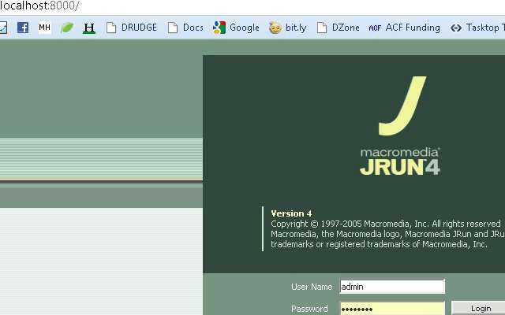
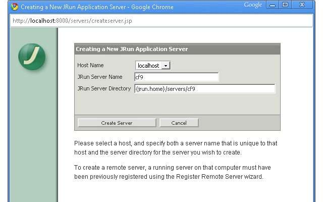
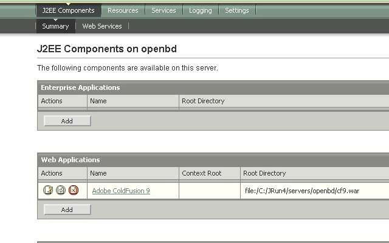
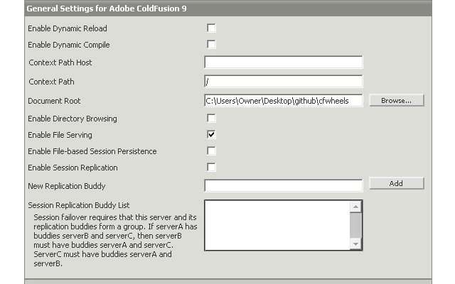

This tutorial will show how using Adobe ColdFusion server with Multiserver configuration, so you can have multiple ColdFusion engines / version running. I think the approach is useful since most Adobe ColdFusion developers probably have Adobe ColdFusion setup as Multiple Instances. This approach allows easier ability to get started with a different CF version or engine without adding Apache or another application server like Tomcat or Resin. Another feature is with JRUN, I am able to point the instances to one code base. Essentially, JRUN4 has a feature that I can't duplicate with Tomcat allowing me to point to one codebase folder. There are other blog entries on using JRUN with other CFML versions and engines: [http://www.andreacfm.com/installing-railo-on-jrun4](http://www.andreacfm.com/installing-railo-on-jrun4) [http://corfield.org/entry/Railo\_\_ColdFusion\_on\_JRun](http://corfield.org/entry/Railo__ColdFusion_on_JRun)

This approach differs slightly by using the JRUN administrator and not exploding the war file manually.

## Prep

Install Adobe ColdFusion 8 (ACF 8) or Adobe ColdFusion 9 (ACF 9) as Multiserver Configuration. Review the [Installing Multiple Versions of ColdFusion Together slides](http://slidesix.com/view/Installing-Multiple-Versions-of-ColdFusion-Together) if you aren't familar with the installation wizard up to slide 12. Depending on if you installed ACF 8 or ACF 9, run the other version installation process and select J2EE configation and war file. See slide 13 but select war. Okay, so we have one version of Adobe ColdFusion running using a port, example: http://localhost:830X , and a war file for the other ACF version.

## Adding New JRUN instance

Now go to the JRUN4 admin page http://localhost:8000 If the page doesn't load, make sure you have the instance started. For me, I go to my Services window and start "Macromedia JRun Admin Server". 

## Create New Server

After logged in, Select "Create New Server" along the top of the home page. My case, I had ACF 8 installed as Multiserver configuration, so I am creating a new jrun instance for ACF 9.  Select "Create Server, then  jot down the port number for this new jrun instance, select "Finish". Now, copy the ACF war for the other ACF version you created and paste it in the JRun server path you created. In my example it is C:\\JRun4\\servers\\cf9. We can delete the default-ear created by JRUN. Next within the JRUN administration page, press the start button near the instance we just created. Once started, the row will turn white from orange. Select the name link, our example is CF9. When we started our cf9 instance, it automatically deploy the war we moved into C:\\JRun4\\servers\\cf9.  Now, select the link in the Web Applications section. On the next page  in the "Context Path" field, place / . And "Document Root" field put in your code base location. For me, I put in "C:\\Users\\Owner\\Desktop\\github\\cfwheels".  Now, select Apply. You may get an deployment error but it seems to be a false error message. Now in your browser put in "http://localhost:830X/CFIDE/administrator/index.cfm" and finish the installation process for this version of Adobe ColdFusion. Summary of what we have now. We have two versions of ACF running on different ports.

## Railo

[Download the Railo war](http://www.getrailo.org/index.cfm/download/) file and repeat the process for Create New Server. I noticed I need the index.cfm for Railo on JRUN4. If used http://localhost:830X/ I would get a 403 Forbidden message.

## OpenBD

The process should work for OpenBD but some reason ([download the OpenBD war here](http://www.openbluedragon.org/download.cfm)), OpenBD doesn't respect the document root set in the jrun administion page so it goes to C:\\JRun4\\servers\\openbd . Also the cfm pages get an error. I created a ticket for the [issue](http://code.google.com/p/openbluedragon/issues/detail?id=242).

## Conclusion

Next post I will explain how to add Apache to this so we don't have to use the ports. We will be able to go to http://cf9.local, http://railo.local, etc. If you don't want to wait, there is plenty of information on regarding virtual hosts with Apache.
