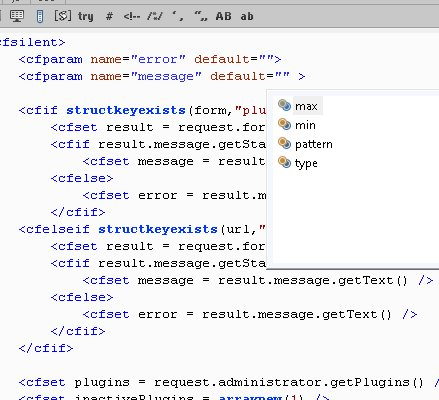
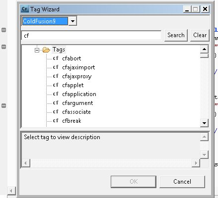
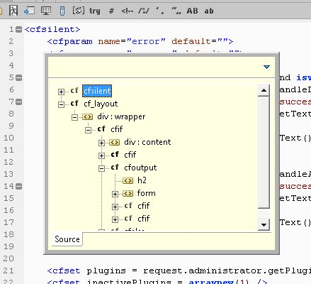

I haven't been able to use [ColdFusion Builder](http://labs.adobe.com/technologies/coldfusionbuilder/) extensively yet, but here are my favorite 8 key assists so far.

### First group is

First group is not too amazing and still should be mentioned. They are available in [CFEclipse](http://www.cfeclipse.org) but the wrap in pound signs binding is a different combination.

- ctrl+shift+a - insert cfabort  
    
- ctrl+shift+d - insert cfdump  
    
- ctrl+shift+h - wrap in ##  
    
- ctrl+space - Content Assist (image below is the CFBuilder assist within a cfparam)

### Here are some new key assists in ColdFusion Builder

- ctrl+shift+f - format code, this has been missing since I switched to Eclipse for my ColdFusion coding.
- ctrl+= - insert cfset - I am not certain, but don't think CFEclipse has a shortcut for cfset. I have missed it, if it exists in CFEclipse.
- ctrl+t - tag wizard, opens up a dictionary for ColdFusion tags and if you select a tag it will walk you through a wizard. I would like to see syntax usage of the tags in the dictionary view before having go to the wizard. Also it would be great if ColdFusion functions were available also for searching and help.

### And my favorite is....

ctrl+o - opens a outline fast view and you can filter on the contents to quickly get to code on the page. See [Raymod Camden's video on the Outline view](http://www.coldfusionjedi.com/index.cfm/2009/7/17/ColdFusion-Builder-and-Outline-Mode) for more. 
