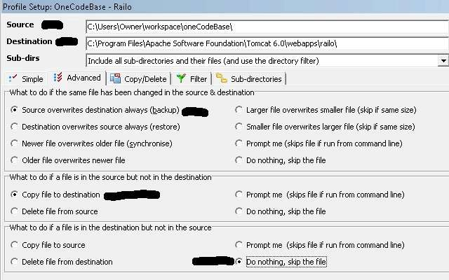
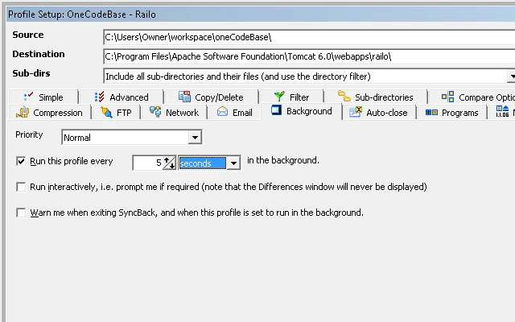

I have been playing with different CFML engines for the [ColdFusion on Wheels](http://www.cfwheels.org) codebase so I was looking for a solution where I could work on the code in one location and have it connected to the different cfml engines directly under the webroot. There may be a solution using Apache and Tomcat settings but I haven't found one yet. Here is my poor man's solution to the problem. It is synching the code from one location to several folders representing the different CFML engines.

# Prerequisite:

[Installing and Configuring Apache 2.2, Tomcat 6.0, and Open BlueDragon on Windows 2003 Server](http://www.mattwoodward.com/blog/index.cfm?event=showEntry&entryId=03233F6F-ED2C-43C7-AFF5FA2B3C3D845B) by Matt Woodward [Open BlueDragon + Railo + ColdFusion on Tomcat](http://www.mattwoodward.com/blog/index.cfm?event=showEntry&entryId=60F08421-5F0A-41C9-940B3681A3D09D99) by Matt Woodward ["Running Multiple CFML Engines on Apache Tomcat" Presentation](http://experts.na3.acrobat.com/p13033917/) by Matt Woodward

# Software:

[SyncBack Freeware](http://download.cnet.com/SyncBack-Freeware/3000-2242_4-10413802.html) Now since you have tomcat, apache, and the cfml engines setup as in Matt's instructions and installed SyncBack Freeware. Let's setup the code base in Eclipse so create a Project under your workspace called OneCodeBase and copy in your cfm files there.  
Next open SyncBack and create a Profile (New Button OR Profiles --> New OR Control-N)  
Select "Backup: for copying files to another directory, drive, FTP server, etc" and next.  
For the named put in "OneCodeBase - Railo" and ok. A profile setup wizard will appear. Fill in the Source: C:\\Users\\Owner\\workspace\\oneCodeBase\\ and Destination: C:\\Program Files\\Apache Software Foundation\\Tomcat 6.0\\webapps\\railo\\  
Then select Advanced tab. I marked the sections we will be concerned with in the Profile Setup wizard.  "What to do if the same file has been changed in the source & destination" Section

- Source overwrites destination always (backup)

"What to do if a file is in the source but not in the destination" Section

- Copy file to destination

"What to do if a file is in the destination but not in the source" Section

- Do Nothing, Skip the file

  
Select Expert button, then Background tab. Check "Run this profile every" and change to 5 seconds "in the background"  
  
(Optional) I am using git and don't need all that moved over to my web roots.  
Select Filter tab, in the"Directories NOT to copy" Section, add .git  
Now select OK and No.  
You should see your profile updating every 5 seconds. The last run should be updating in SyncBack. Copy the profile and repeat for your other engines changing the destination.  

# Other Approaches:

[Running your CFML code through Railo, OpenBD, and Adobe CF all at once](http://www.stillnetstudios.com/run-code-railo-openbd-adobe-cf-at-once/) by Ryan Stille  
[How do you test CFML against multiple versions of ColdFusion?](http://www.compoundtheory.com/?action=displayPost&ID=334) by Mark Mandel  
[How would you run code against multiple CF versions at once using IIS on XP?](http://www.carehart.org/blog/client/index.cfm/2007/8/21/multiple_cf_versions_on_IIS_XP) by Charlie Arehart
