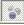
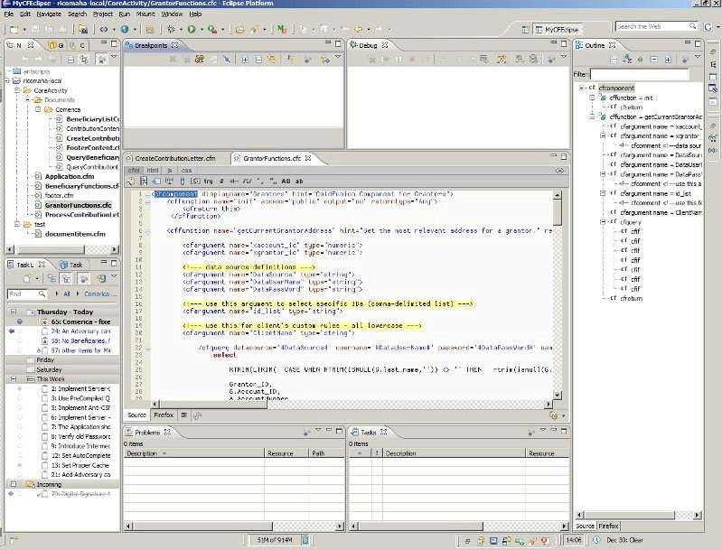
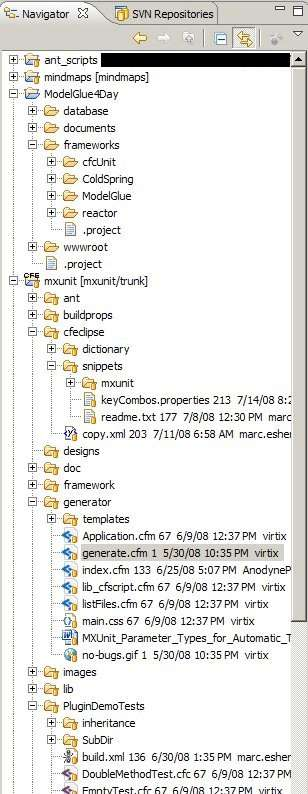
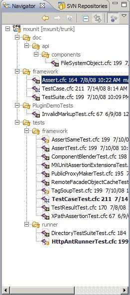
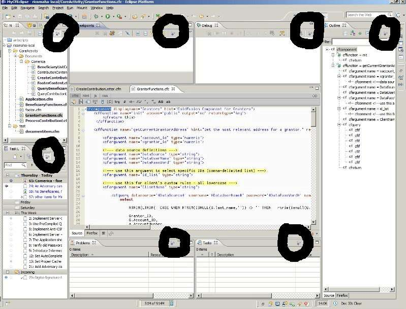

Can you find all the purple balls  in the screenshot of [Eclipse](http://www.eclipse.org) with a [ColdFusion](http://en.wikipedia.org/wiki/ColdFusion) plugin? **\[Insert Brett Farve & Vikings joke here\]**

Those purple balls are [Mylyn](http://www.eclipse.org/mylyn/) focus buttons. You may not have even noticed them in Eclipse before. Think of them as the [Staple's Easy button](http://media.staples.com/easybutton/demo.html). The purple balls will focus the view on resources relevant to the task you are working on.

Another example of "focus" is this: Think of my work desk. It is cluttered with papers, books, and other office resources. If my "desk view" had a Mylyn focus button, all the clutter would disappear and only the resources I need at a particular time would be available. The hidden resources didn't get put into the office trash can. The resources are just not seen, reducing the clutter.

What does "focus" mean to you as a programmer? Well, a picture is worth a thousand words. **\[Insert Another Brett Farve & Vikings joke here\]**

| _Show navigator with Mylyn focus toggled off_  | _Show navigator with Mylyn focus toggled on_  |
| ----------------------------------------------------------------- | ---------------------------------------------------------------- |

Notice, with Mylyn Focus toggled on in the Navigator view, I only see important files for the task at hand. You may wonder how do the purple balls know what is relevant? This is done by Mylyn's Task Focused Interface. You create and activate a task, then start working with resources in Eclipse. The resources (or context) get remembered by the task as you work.

This context will remain with the task and should work with any view containing the purple balls. Check out [CFEclipse Feature Review: Tasks](http://cfeclipse.org/index.cfm/blog/cfeclipse-feature-review-tasks/) for more information on the Task view (not to be confused with the Task List view). When I tap the purple balls in the Task view and activate them, only relevant tasks will show.

Here you can see all the purple balls circled if you missed one from the original picture. They are in these views: Breakpoints, Navigator, Task List, Tasks, Problems, Outline, and Debug.

