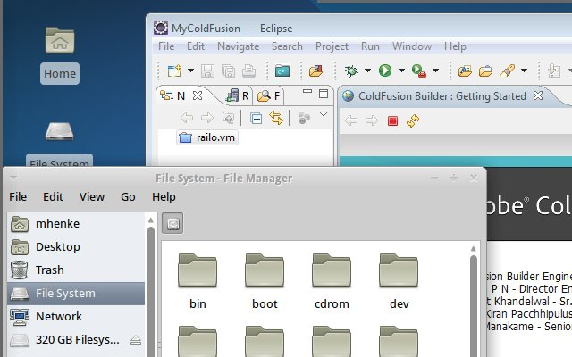

I recently switched to [Xubuntu](http://www.xubuntu.org/) as mentioned in a couple recent posts. This weekend I was playing around with [Turnkey Tomcat-Apache-ColdFusion](/post.cfm/developers-guide-to-turnkey-tomcat-apache-with-coldfusion-engines) and used [Eclipse](http://www.eclipse.org/) to connect to the virtual machine. I found [CFEclipse](http://cfeclipse.org/) wouldn't save the cfml file using a [RSE](http://www.eclipse.org/tm/) connection unless I switched the file editor but I would lose syntax and highlighting. [ColdFusion Builder](http://www.adobe.com/products/coldfusion-builder/features.html) and seamless [Virtualbox](http://www.virtualbox.org/) to the rescue. Take a look at my Xubuntu screen with CFBuilder behind Thunar (File Manager).  The key is to setup a VirtualBox machine with Windows and then install [Guest Additions](http://www.virtualbox.org/manual/ch04.html) on the vm. Next install and start ColdFusion Builder in the vm and then go into seamless mode. You can select **right Ctrl-L** or from the vm menu select **Machine - Switch to Seamless Mode** to start/end seamless mode. I did try CFBuilder with [Wine](http://www.winehq.org/) on Linux but didn't have much success.
