This is a 4 part series over [Git](http://git-scm.com/) and [GitHub](http://github.com/) with [Riaforge](http://www.riaforge.org/). So far we [installed some software](/setting-up-a-riaforge-projects-with-git-and-github-part-1), [registered for a free GitHub account, created a repository, and cloned it](/setting-up-a-riaforge-projects-with-git-and-github-part-2).  
  
Lets demonstrate the power of GitHub, anyone can make contributes to a project on GitHub. We will be using [CWheels](http://cfwheels.org/) on GitHub to create a fork and send a pull request of our changes to CFWheels.

### Forking Bad, Think Again

[Forking](http://en.wikipedia.org/wiki/Fork_%28software_development%29)? You may thing forking is bad. Recently, [CFHour()](http://cfhour.com/) podcast even mentioned that forking isn't good but they are wrong. They are likely using a source control system that makes branching and forking difficult. Forking in git is encouraged. Git makes it easy to merge forks whenever.

### Forking made easy

Log into GitHub with your username and password, then go to CFWheels on GitHub ([http://github.com/rip747/CFWheels](http://github.com/rip747/CFWheels)). You will notice this page is slightly different then the repository home page we created. This has only a public clone url and a fork button. Click on that fork button. 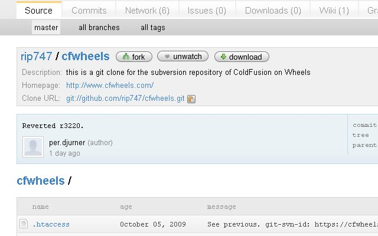 In a couple seconds, you should have your own CFWheels fork. When completed, notice CFWheels is now under your name (my example is [http://github.com/mhenke/CFWheels](http://github.com/mhenke/CFWheels)) Copy your new clone url. Mine is git@github.com:mhenke/cfwheels.git, yours should be similar.

### Set Up

We will start with a fresh local ColdFusion multi server instance to place the code in. Also please have everything working from the previous posts.

### Cloning our CFWheels Fork

We cloned a newly create GitHub repository through the command prompt in the [last post](/setting-up-a-riaforge-projects-with-git-and-github-part-2) but we also installed two other git clients. One integrating with Eclipse, [eGit](http://www.eclipse.org/egit/), and the other with Windows Explorer, [TortoiseGit](http://code.google.com/p/tortoisegit/) (TG).  
  
Navigate to your webroot (mine is C:\\JRun4\\servers\\CFWheels\\cfusion.ear\\cfusion.war ) and right click on the folder or inside the folder to create the git repository. This screenshot is the former and shows how TG is integrated into Windows Explorer. Select "Git Create repository here"  
  
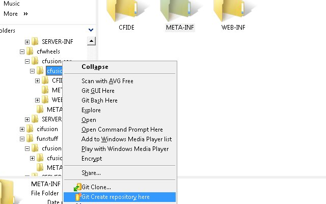  
  
As you have noticed, a folder called .git has been created. If using the command prompt, we would have navigated into the folder and run "git init".

### Adding A Remote

Now we will tell this git instance about our CFWheels fork on GitHub by adding a remote reference. If using the command prompt, we would run "git remote add origin git://git@github.com:mhenke/cfwheels.git" within our webroot. Using TG, right click in the webroot, select TortoiseGit --> Settings.  
  
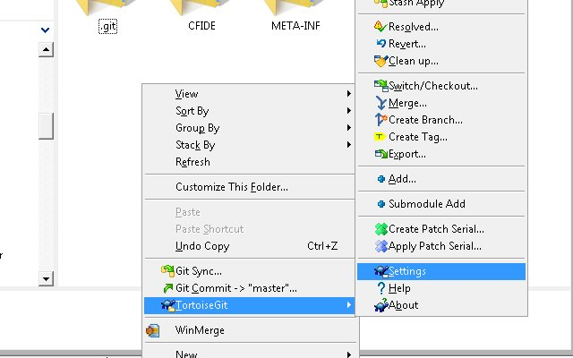  
  
Then in the dialog box, select Remote under Git, press "Add New", and paste in our CFWheels fork url we copied previously, click "Apply", then "Ok".  
  
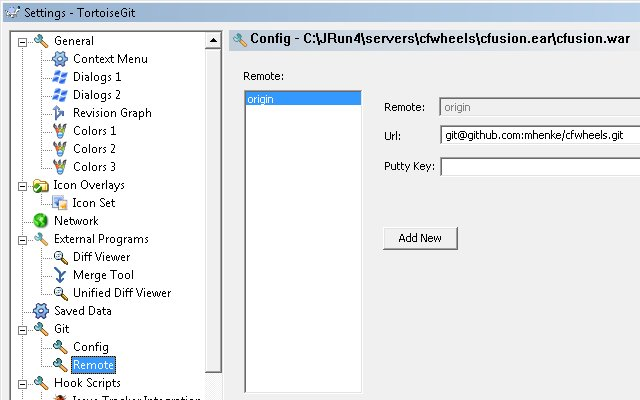

### Fetching our CFWheels Fork

Now we will do a fetch. Git has three commands dealing with remote repositories. Push and Fetch are opposites and do what the sound like. Pull actually does a Fetch plus a merge. Committing is only to our local repository.  
  
Right-click in the webroot and select Fetch. A dialog box should appear and select OK.  
  
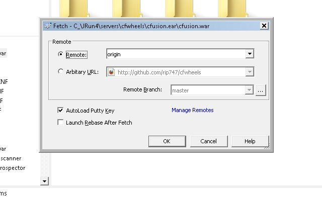  
  
We could have created our remote with the "Manage Remotes" on the fetch dialog box. Close the Git Command Progress dialog window, but notice the git command for the command prompt. TG actually created two branches also.  
  
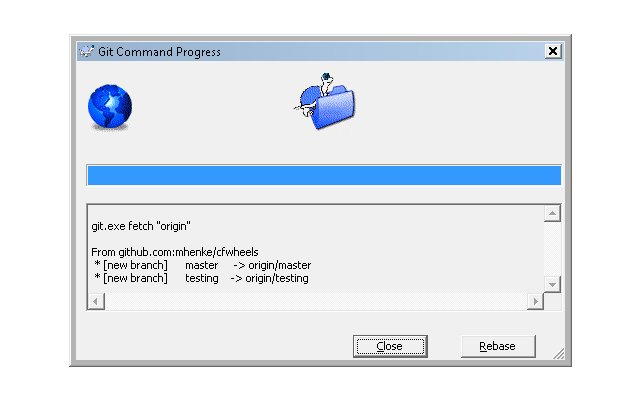  
  
You may be disappointed when you check the webroot since no files were created. We actually have to tell git what branch to switch/checkout. Right click in our webroot folder and select TortoiseGit --> Switch/Checkout.  
  
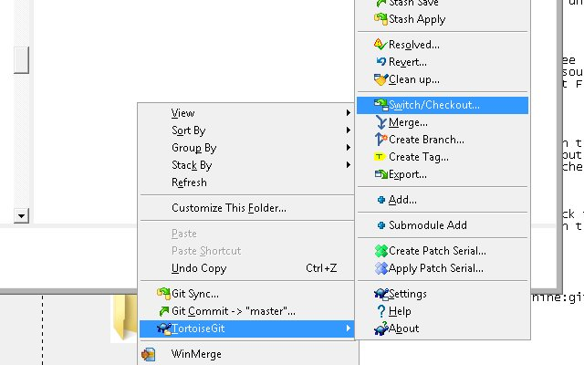  
  
Make sure to use the master branch and press Ok. Now we have files to work with.  
  
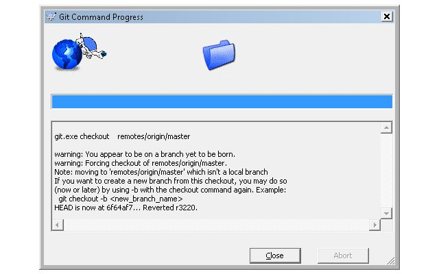

### Setting up eGit

We have to create a symbolic link used by eGit to .ssh called ssh. If you are using Vista, open the command prompt and navigate to the folder containing the .ssh folder you created in Part 2 (mine is "C:\\Users\\Owner\\"). Run this command "mklink /D ssh .ssh". If you are using XP, download this program "[Junction Link Magic 1.0](http://www.softpedia.com/get/System/System-Miscellaneous/Junction-Link-Magic.shtml)" and create a link to .ssh from ssh.

### Setting up a global ignore

Let's add an global ignore file before making changes. I placed mine in C:\\JRun4\\servers . In the command prompt, navigate to our CFWheels webroot with the git repository. Run "git status". Notice the untracked files, these are files we don't want to add to the repository and aren't staged yet. Any changes need to be staged to be committed. This is different from SVN since if we modify a file and commit it would get commit to the SVN repository. Git has an extra space called stage. This is nice if we want to customize our commit. 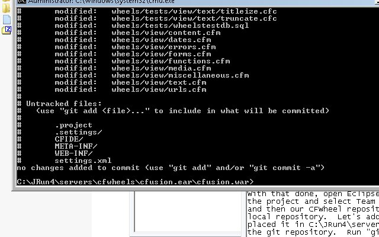 My .gitignore files contains this: # Ignore these folders and sub content  
CFIDE/\*  
  
META-INF/\*  
  
WEB-INF/\*  
  
  
  
\# Ignore all dotfiles...  
.\*  
  
\# except for .gitignore  
!.gitignore /.\*/\*  
So let's add the global exclude file by running git config --global core.excludesfile "C:\\JRun4\\servers\\.gitignore". In the command prompt, do another "git status", notice only one file is shown as untracked. If we wanted to commit that file, we would "git add settings.xml" and it would be tracked but still not staged.  
  
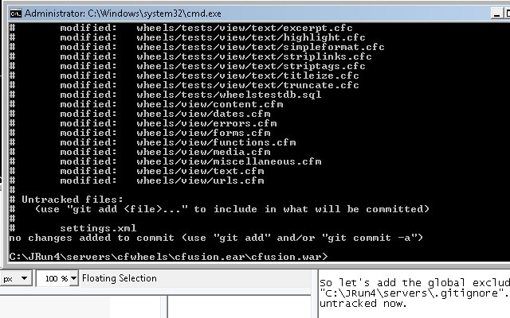

### Make an Awesome Contribution

With that done, open Eclipse, create a project to our CFWheels webroot. Then right-click on the project and select Team --> Share Project. In the Share Project dialog box, select Git, then our CFWheel repository, and click Finish. You can now make commits to our local repository by right clicking on the project folder, selecting Team, then Commit. When we want to push to our remote repository on GitHub, right click on the project folder, select Team, then Push To.

### Push To Walkthrough  

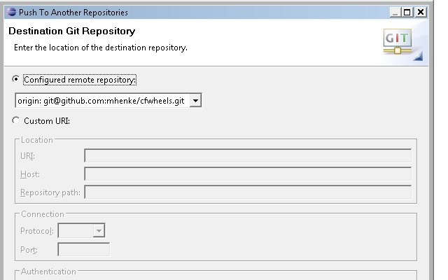  
  
Select Next and Yes a couple times on the SS2 Messages. Usually, I push "Add all bracnhes spec" but some reason, it didn't work this time so I selected items from source ref and destination ref, clicked add spec. and then Finish. 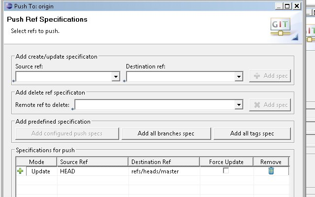  
  
I am going to wrap this post up. You can see my awesome contribute here [http://github.com/mhenke/cfwheels/commits/master](http://github.com/mhenke/cfwheels/commits/master). Next I would click on the pull request button on my CFWheels fork page to notify CFWheels about the changes.

### Screencasts and Videos to Watch

  
[Getting started with GitHub (Teach Me To Code)](http://www.teachmetocode.com/screencasts/5) [GitCasts](http://gitcasts.com/) [Insider Guide to GitHub screencasts with Scott Chacon](http://www.pragprog.com/screencasts/v-scgithub/insider-guide-to-github)
