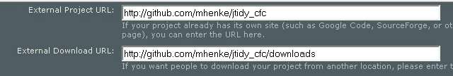
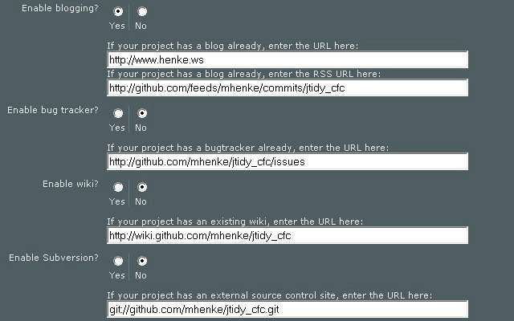

[Riaforge](http://www.riaforge.org) recently added an input field for external source control sites and [Github](http://www.github.com/) now [recognizes ColdFusion syntax](/github-recognizes-cfml). With these two announcements, I will demonstrate how to edit your Riaforge project information for Github. I will use [jTidy cfc](http://jtidy.riaforge.org/) for the example. Filling from top to bottom of the Edit project page, you will proceed normally until **External Project URL** and **External Download URL**.

### Example

External Project URL: [_http://github.com/mhenke/jtidy\_cfc_](http://github.com/mhenke/jtidy_cfc)  
External Download URL: [_http://github.com/mhenke/jtidy\_cfc/downloads_](http://github.com/mhenke/jtidy_cfc/downloads)  The next field you will be concerned with is **"Enable blogging?"**, select Yes. In the "**If your project has a blog already, enter the URL here:**" field put your blog or the github url you used in the "**External Project URL**". _http://mikehenke.com_ In the "**If your project has a blog already, enter the RSS URL here:**" field put the github rss feed for your commits here. [_http://github.com/feeds/mhenke/commits/jtidy\_cfc_](http://github.com/feeds/mhenke/commits/jtidy_cfc) In the "**Enable bug tracker?**" field, select No. In the "**If your project has a bugtracker already, enter the URL here**:" field put github issue tracker for your repository. [_http://github.com/mhenke/jtidy\_cfc/issues_](http://github.com/mhenke/jtidy_cfc/issues) In the "**Enable wiki?**" field, select No. In the "**If your project has an existing wiki, enter the URL here:**" field, put the github wiki url for your repository here. [_http://wiki.github.com/mhenke/jtidy\_cfc_](http://wiki.github.com/mhenke/jtidy_cfc) In the "**Enable Subversion?**", select No. In the "**If your project has an external source control site, enter the URL here:**" put your read-only github url here. _git://github.com/mhenke/jtidy\_cfc.git_  Now submit the updated information. Hopefully this helps you on using Riaforge and Github.
