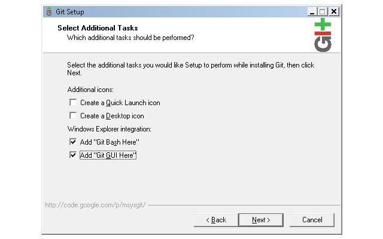
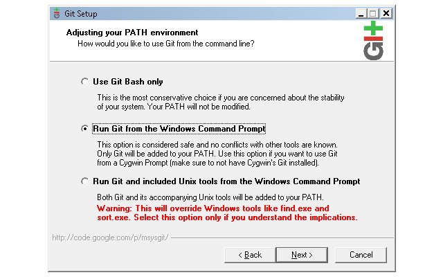
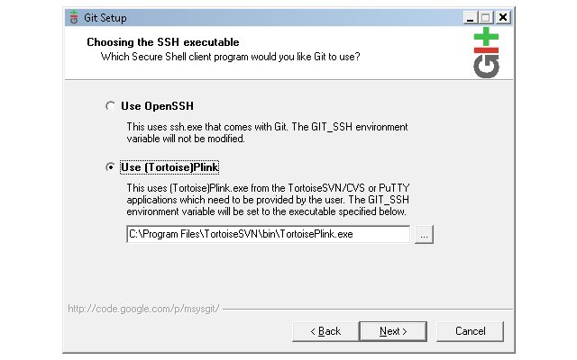
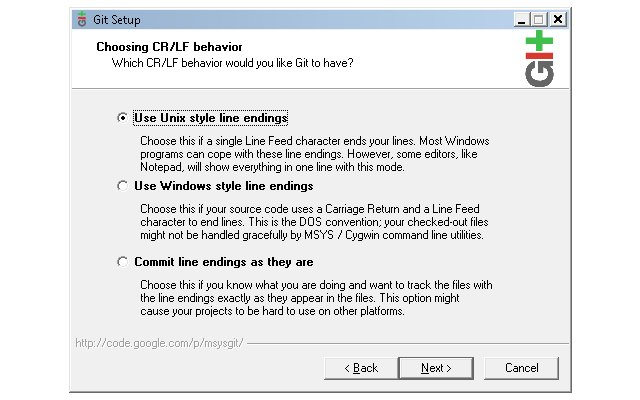
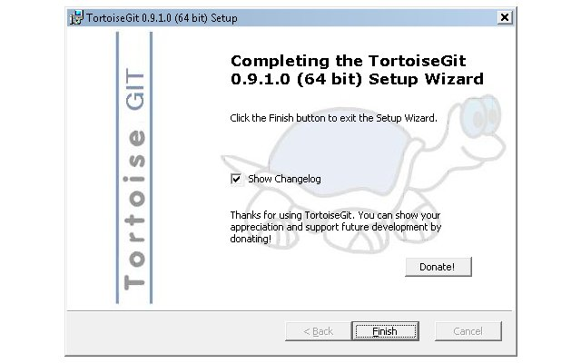
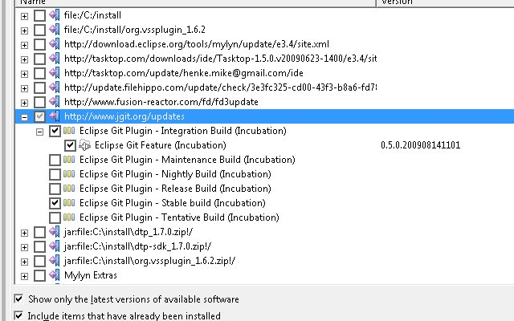
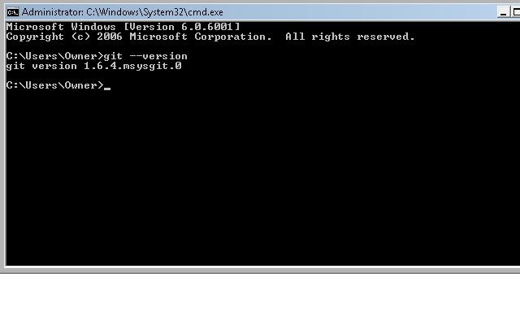

I will show how to switch a [Riaforge](http://www.riaforge.com) project using [SVN](http://en.wikipedia.org/wiki/Subversion_%28software%29) to use [Git](<http://en.wikipedia.org/wiki/Git_(software)>) and [Github](http://github.com/). Git is more geared for open source projects since it easily allows contributes from anyone. A hierarchy might eventually evolve where the project owner watches four of his trusted friends, then those four might watch a couple other repositories, and changes from the bottom filter up. Confused yet? Don't worry, we will work through this process with a RiaForge project. Another useful case is the orginal project creator, has moved on to other things so the project isn't advancing. Some developers maybe working on the project but no way to commit the changes. Git would allow people to see the project fork and the active repository may become where people will start going to pulling from. First, we will install [msysygit](http://code.google.com/p/msysgit/), [tortoisegit](http://code.google.com/p/tortoisegit/) (a port of [tortoisesvn](http://tortoisesvn.tigris.org/)), and [EGit](http://git.or.cz/gitwiki/EclipsePlugin), an Eclipse plugin. Then, we will setup a free Github account, create a Git repository for our Riaforge project, import our SVN repository, and then change the Riaforge settings to show our new repository. After that we can show how the scenerios I mentioned above may work. I am on a Vista laptop. I downloaded the full installer from msysgit (Git-1.6.4-preview20090730.exe) and installed it. I clicked through the default until this screen and unchecked the top two options.  The next series of slides will show when I diverted from the default settings.    There, installed msysgit and nothing smoking yet. We can take a deep sigh of relief.

Well, lets tackle [tortiosegit](http://code.google.com/p/tortoisegit/). Navigate to the download page, and select the appropriate file for your system. I selected TortoiseGit-0.9.1.0-64bit.msi since my laptop is 64bit. This installation wizard is a lot less threating. Just a couple clicks and finished.   
You thought we were out of the woods, but the installer will ask you to reboot. This is for the icons so we can skip rebooting for now.

Next for the Eclipse plugin, go to [Egit](http://git.or.cz/gitwiki/EclipsePlugin)'s home page. You should see an update site for the plugin and copy it. Start your Eclipse. I will be using [ColdFusion Builder's beta](http://labs.adobe.com/technologies/coldfusionbuilder/). Once started, select Help from the menu and then "Software Updates". Click "Add Site", the paste in the update site url, and select "Ok."

You will see the url in the wizard window, select the two items I have below then press "Install..." And finish out the wizard.  Reboot your system, then open the command prompt and type in "git --version".  Success!! Congratulations you are your way to being a Git expert and helping advance ColdFusion Open Source projects. GitHub's [docs](http://github.com/guides/home) is a great start if you want to read more on using Git and GitHub. [IBM's developerWorks also has several articles about Git](http://www.ibm.com/developerworks/search/searchResults.jsp?searchType=1&searchSite=dW&searchScope=dW&query=git&Search=Search).
