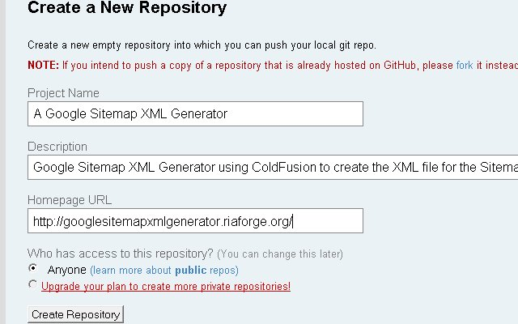
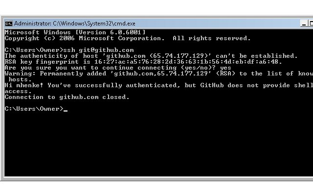
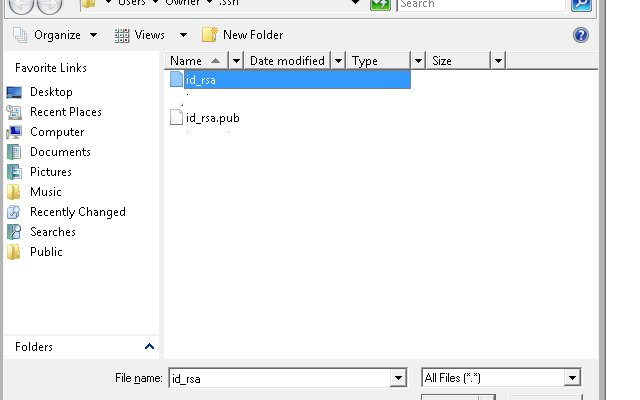
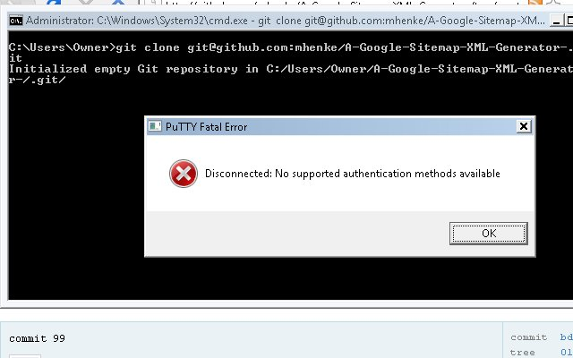
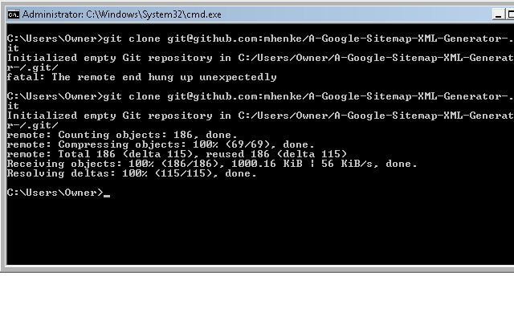

This is a series over using [Riaforge](http://riaforge.org/) with [Git](http://git-scm.com/) and [GitHub](https://github.com/). So far we [installed some software](/setting-up-a-riaforge-projects-with-git-and-github-part-1), next we will register for a free GitHub, create a repository, and clone it.

Registering will only take a couple seconds. Go to the [signup page](https://github.com/signup/free).

Fill out the information but skip the SSH Public Key field. After submitting the registration form, you will be presented the dashboard screen. Select "Create a Repository" and fill out this page. Put in your RiaForge project name in the "Project Name" field, add a little description in that field (be sure to put mention ColdFusion), in the "Homepage URL" field copy your RiaForge url, and hit the "Create Repository" button.

Next page will have some information we can skip for now. Click on the link below "Importing a Subversion Repo?". Paste in your SVN Repository URL where is says "SVN Repository URL". Click "Import SVN Authors". GitHub will read your SVN repository and display any authors it finds.

**READ CAREFULLY HERE.** Either fill out all the authors as shown or NONE. Also when you submit this form, the import process may take only minutes up to 5 days depending on the size of your repository. You will recieve and email from GitHub when the process is finished.

After submitting you will be taken back to the master page of your new GitHub repository for this project.

### Configuring Local System

Let's configure our local system now and create a SSH public key. This will be used to authenticate you when doing push and pull commands to git. Open up the command prompt and run these commands. Replace your information with mine.  
Click return/yes on any popups.

\[code language="coldfusion"\]
git config --global user.name "mhenke"
\\[/code\] \[code language="coldfusion"\]
git config --global user.email "henke.mike@gmail.com"
\\[/code\] \[code language="coldfusion"\]
ssh-keygen -t rsa
\\[/code\] \[code language="coldfusion"\]
git config --global core.autocrlf true
\\[/code\] This \[code language="coldfusion"\]
ssh-keygen
\\[/code\] command will create a .ssh folder and two files inside it. This folder is located at "C:\\Users\\Owner\\.ssh" for me. Inside are two files, id_rsa and id_rsa.pub. The first is your private key and the second is your public key.

Let's test the authentication. Go back to your command prompt and type in this command.

\[code language="coldfusion"\]
ssh git@github.com
\\[/code\] Hopefully you see something like this.

### Workaround

Next is step is kinda a work around for something TortoiseGit installed and will be used to for our private clone.

Open up, PuttyGen. It should be under the Start menu, TortoiseGit. Next load our private key we created. File --> "Load private key" and then naviagate to our id_rsa file. You will have to select "All Files (\*.\*)" so you can see our private key and press Open.

A dialog box will open and press ok. Next select, File --> "Save private key". Click "Yes" and put in "id_rsa.ppk" and then save. This is for our workaround.

Next we will copy the key shown in PuttyGen and paste it into GitHub. If you are still logged into GitHub, there should be an "account" link toward the right top of the page. Select that and then scroll down. Under "SSH Public Keys" select "add another public key", put in the title "rsa_id", paste in the copied key from PuttyGen and save it.

One last thing while here on the GitHub Account page, scroll back toward the top and you should see a "Your User Information" panel. Select the "Global Git Config" link. GitHub is user friendly and will prove snippets for you to copy, paste, and run. Copy the second line and run it in your command prompt.

\[code language="coldfusion"\]
git config --global github.token xxxxxxxxGITHUBTOKENxxxxxxxxxxx
\\[/code\]

### Cloning

Let's wrap up the long entry by running cloning our git repository. Navigate on GitHub to the repository home page. Click on the link next to "Your Clone URL". Copy this snippet to your command prompt and run it.

This is the work around error, I mentioned. Create a text file and paste in this.

\[code language="coldfusion"\]
start "start pageant" /B "C:\Program Files\TortoiseGit\bin\pageant.exe" "C:/Users/Owner/.ssh/id_rsa.ppk"
\\[/code\] \[code language="coldfusion"\]
exit
\\[/code\]  
And save it as github.bat. Create a shortcut and put it in your startup or if you want just run the batch when you are using GitHub. Run the batch file now and you should see an new icon your Notification area.

Now rerun our clone command in our dos prompt.

### Conclusion

Well, now you have a working copy of our GitHub repos. We covered alot and my next post will explain more in depth what we did, along with how to work with our new clone. I recommend watching the "[Insider Guide to GitHub](http://www.pragprog.com/screencasts/v-scgithub/insider-guide-to-github)" screencast and "[Setup, Initialization and Cloning](http://gitcasts.com/posts/setup-initialization-and-cloning)" episode from [GitCast](http://gitcasts.com/).

For more on what we did read these links.  
[Setting user name, email and GitHub token](http://help.github.com/git-email-settings/)  
[Guides: Providing your SSH Key](http://github.com/guides/providing-your-ssh-key)  
[Guides: Dealing with newlines in git](http://github.com/guides/dealing-with-newlines-in-git)
