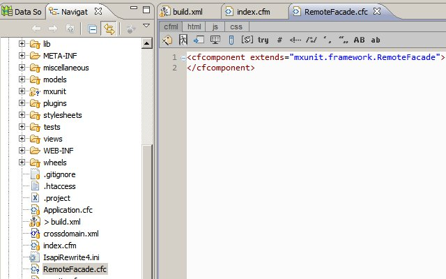
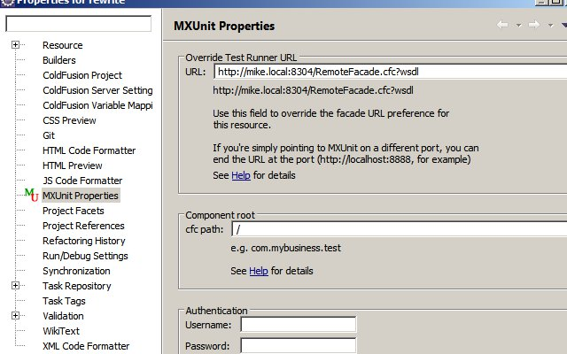
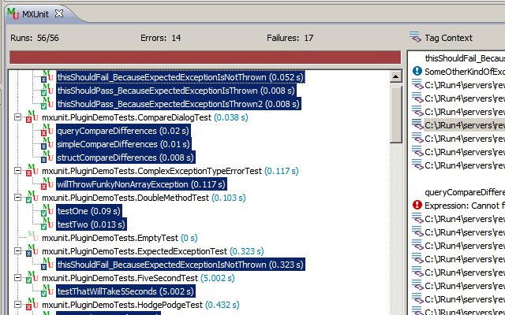

I setup up [MXUnit](http://mxunit.org/) Eclipse plugin with [CFWheels](http://cfwheels.org/) this afternoon. The [MXUnit documentation](http://cfinnovate.com:9082/display/default/MXUnit+Documentation) is very good. I downloaded MXUnit and dropped the mxunit folder in my Wheels root which happens to be the web root also. Then I [installed the MXUnit Eclipse plugin](http://cfinnovate.com:9082/display/default/Install+the+Eclipse+Plugin). Once installed, I [created custom Remote Facade](http://cfinnovate.com:9082/display/default/Running+your+Tests+under+the+Application+Scope+--+Custom+RemoteFacades) in my wheels application web root.  Next I point the Eclipse project containing the Wheels application to the new remote facade URL as mentioned in the directions above: Right click on the project name in the Navigator or Project Explorer, Select "Properties"Select - "MXUnit Properties" then add the path to your custom remote URL. And I tested using the "Test Facade URL" button.  Next I walked through the [Configure and Test the Plugin](http://cfinnovate.com:9082/display/default/Configure+and+Test+the+Plugin) section from MXUnit's documentation and here are my results. 
