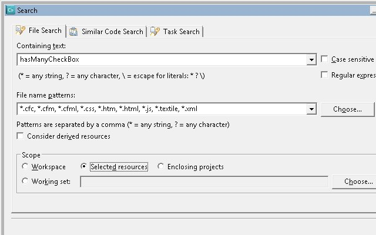
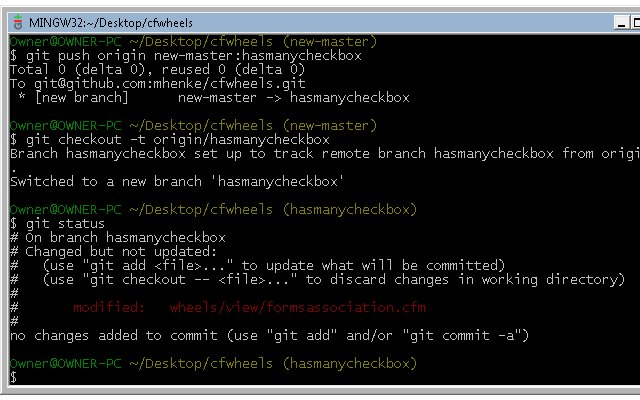
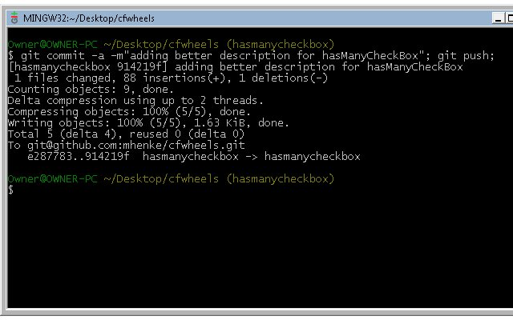
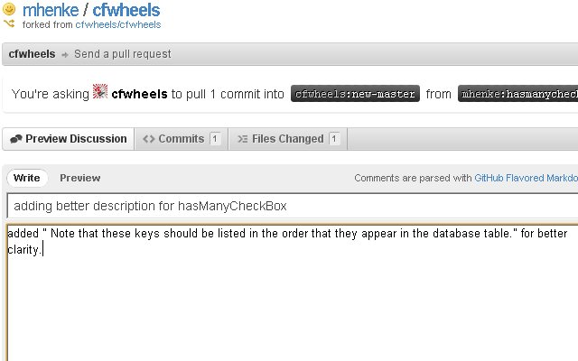

In the [first post of "So you want to contribute to CFWheels"](/post.cfm/so-you-want-to-contribute-to-cfwheels), we created [a free Github account](https://github.com/signup/free) and [forked the CFWheels repo](http://help.github.com/fork-a-repo/). This gave us our own repo we can change. We added a readme file, then sent [a pull request to CFWheels](https://github.com/cfwheels/cfwheels/pull/7). In this post, we will cover how to help [CFWheels](http://www.cfwheels.org) by contributing documentation. Before we make our contibution to the documentation, we should mention how the api documentation is generated. Wheels uses the hint attribute of cffunction and cfargument to generate the descriptions. Lets look at [belongsTo](http://cfwheels.org/docs/1-1/function/belongsTo) documentation. See the descriptions? These are hint parameters in the actual code. We will add a helpful addition to a Wheels function parameters's description. I was working on the many-to-many relationship and using the [hasManyCheckBox()](http://cfwheels.org/docs/1-1/function/hasmanycheckbox) in a form. I was having problems with the keys parameter. The description for keys said "Primary keys associated with this form field." After reading the [Nest Properties chapter](http://cfwheels.org/docs/1-1/chapter/nested-properties), I found a gem stating "Note that these keys should be listed in the order that they appear in the database table." Wouldn't it be great if this gem was in the keys() parameter description? Let's add it and submit a pull request for CFWheels to consider adding it to their code. Now since we understand how Wheels generates its document, we'll make a contribute to the Wheels project Within an editor of your choice, open the Wheels folder we checkouted in part 1. We'll search for "hasManyCheckBox".  This will find 3 files: \[code language="coldfusion"\]
/wheels/models/nestedproperties.cfm
\\[/code\], \[code language="coldfusion"\]
/wheels/views/formsassociation.cfm
\\[/code\], and \[code language="coldfusion"\]
/wheels/views/formsobject.cfm
\\[/code\]. After reviewing them quickly, \[code language="coldfusion"\]
formsassociation.cfm
\\[/code\] has the \[code language="coldfusion"\]
hasManyCheckBox
\\[/code\] function.

\[code language="coldfusion"\]
<cffunction name="hasManyCheckBox" returntype="string" access="public" output="false" hint="Used as a shortcut to output the proper form elements for an association. Note: Pass any additional arguments like `class`, `rel`, and `id`, and the generated tag will also include those values as HTML attributes."
	examples='
		<!--- Show check boxes for associating authors with the current book --->
		<cfloop query="authors">
			##hasManyCheckBox(
				label=authors.fullName,
				objectName="book",
				association="bookAuthors",
				keys="##book.key()##,##authors.id##"
			)##
		</cfloop>
	'
	categories="view-helper,forms-association" chapters="nested-properties" functions="hasMany,hasManyRadioButton,includedInObject,nestedProperties">
	<cfargument name="objectName" type="string" required="true" hint="See documentation for @hasManyRadioButton." />
	<cfargument name="association" type="string" required="true" hint="See documentation for @hasManyRadioButton." />
	<cfargument name="keys" type="string" required="true" hint="See documentation for @hasManyRadioButton." />
		....MORE CODE....
	<cfreturn loc.returnValue />
</cffunction>
\\[/code\]

The keys cfargument says "see @hasManyRadioButton" which is another function in this file which has:

\[code language="coldfusion"\]
<cfargument name="keys" type="string" required="true" hint="Primary keys associated with this form field." />
\\[/code\]

We will add "Note that these keys should be listed in the order that they appear in the database table." to this hint.

\[code language="coldfusion"\]
<cfargument name="keys" type="string" required="true" hint="Primary keys associated with this form field. Note that these keys should be listed in the order that they appear in the database table." />
\\[/code\]

But first we will need to create a topic branch. So open our git bash and run these commands:

\[code language="coldfusion"\]
git push origin new-master:hasmanycheckbox;
git checkout -t origin/hasmanycheckbox;
\\[/code\]

We created a new topic branch for our change, then checked it out. I made the change, then did a "git status" to see the changes in our folder. After that, lets run "git commit -a -m"adding better description for hasManyCheckBox"; git push;".

 This command committed and added any changes to our local git repositry, then pushed them to our GitHub repo. Now we will notify Wheels with a pull request.

We will go to our CFWheels github repo. My repo is located at [https://github.com/mhenke/cfwheels](https://github.com/mhenke/cfwheels). Then we will change our branch using the "Switch Branches" menu option to "hasmanycheckbox" which is the topic branch we created, and select "Pull Request". Once we have filled out the title and body we can send the pull request to CFWheels.

 Here is [our pull](https://github.com/cfwheels/cfwheels/pull/8) request for this documentation change. So now you can help contribute to Wheels documentation. Any contribution is greatly appreciated.
