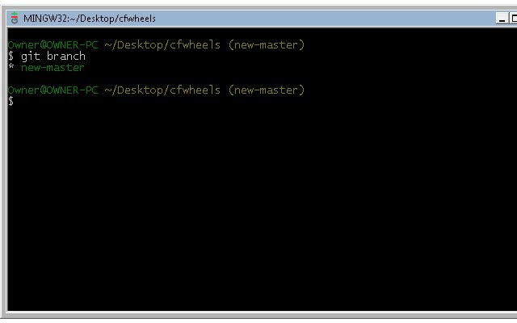
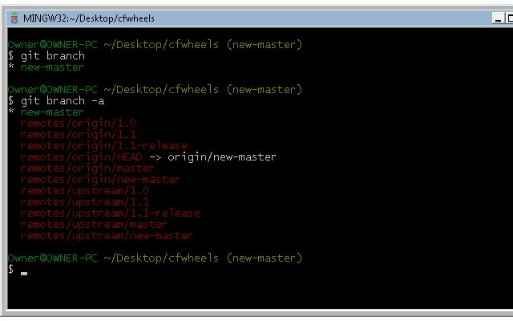
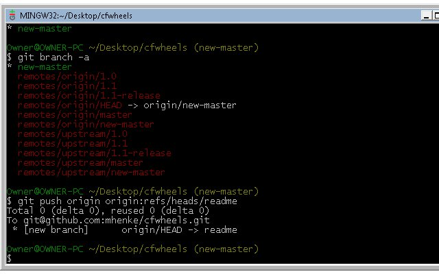
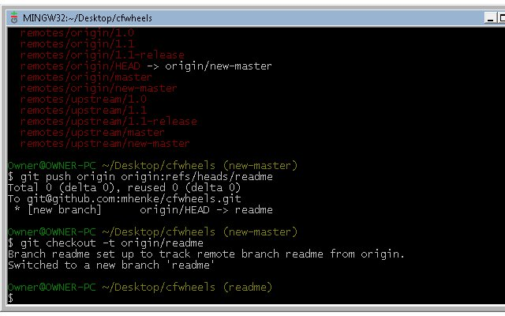
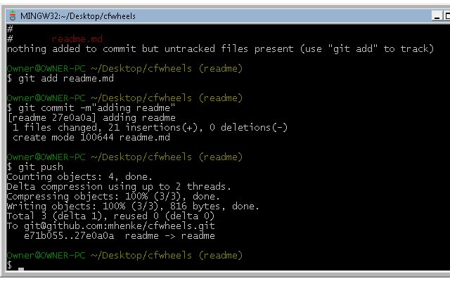
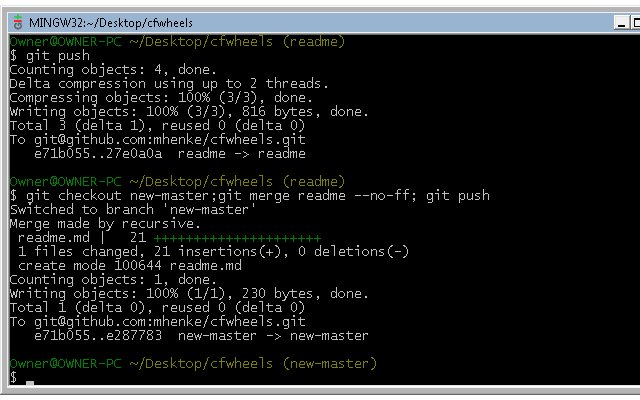
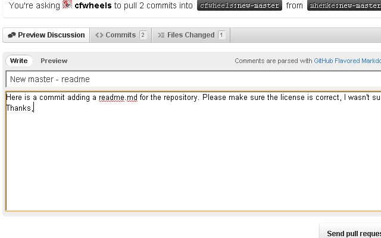

In this blog series I will be walking through how to contribute to an open source project on [GitHub](https://github.com/). I will assume you:

- [Created a free GitHub account](https://github.com/signup/free)
- [Set up Git](http://help.github.com/win-set-up-git/) (includes connecting to github)

First we will fork and setup a local repos of the [CFWheels](http://www.CFWheels.org) project at [https://github.com/cfwheels/cfwheels](https://github.com/cfwheels/cfwheels). Lets refer again to the great github help. They have a walkthrough for [Fork a Repo](http://help.github.com/fork-a-repo/).   After the "Fork a Repo" is completed, open the git bash in our working folder. Type "git branch" and you should see:      Next type "git branch -a" and you should see your local and remote branches:      We'll create a topic branch for our change. This helps isolate our change while Wheels code continues to change. Our command to create a git remote branch is "git push origin origin:refs/heads/new_feature_name". Our topic will be adding a readme file to the CFWheels project. In the git bash type "git push origin origin:refs/heads/readme".      Now we will checkout and track this new topic branch by using this git command "git checkout -t origin/readme"      Now we have our local topic branch. I created a readme.md and placed it in our CFWheels folder. You can do this also. After adding a readme file, lets add our readme.md to our repo by these git commands: git status git add readme.md git commit -m"adding readme" git commit push      The first command checked the status of our working folder, the second command added it into our git stage area, then the third command committed the change with a commit message, and fourth command pushed our change to github. Since our contribution is ready for CFWheels to consider, we'll need to notify them. But first we need to merge our change into the new-master branch using "git checkout new-master; git merge readme --no-ff; git push;". This one line is actually chaining several git commands together. It checkouts out new-master, merges in our changes, and pushes our changes to github.      Now we'll check our repo on GitHub. My fork of CFWheels is at [https://github.com/mhenke/cfwheels](https://github.com/mhenke/cfwheels) . You should see a "Pull Request" button on yours. Click the button, fill out the title for the pull request and body, then press "Send Pull Request".      Congrats, you have walked through the process of contributing to an GitHub project. This article's pull request is [here](https://github.com/cfwheels/cfwheels/pull/7). Our contribution was simple but any contribution is awesome and welcomed for open source projects. Next post we will show how to help with documentation with Wheels.

## Example: Adding a README and pushing to GitHub

After creating or editing a file (e.g., `readme.md`), use these Oh My Zsh git aliases:

```zsh
gaa
gc -m "Add readme"
gp
```

- `gaa` – git add all changes
- `gc -m` – git commit with a message
- `gp` – git push to your remote repository

## Example: Creating and tracking a new branch

```zsh
git push origin origin:refs/heads/readme
git checkout -t origin/readme
```

## Example: Merging a topic branch into main

```zsh
git checkout main
git merge readme --no-ff
gp
```

## Example: NPM Aliases

- `npmi` – npm install
- `npmrs` – npm run start (dev server)
- `npmrb` – npm run build
