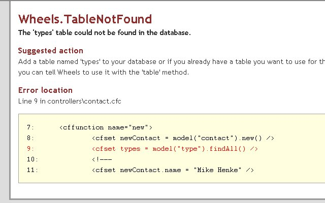
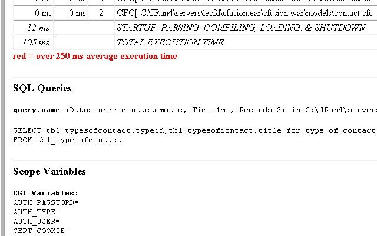
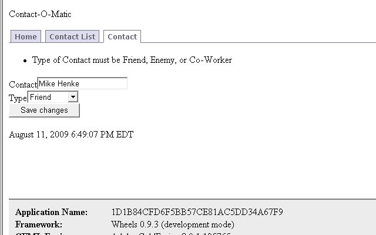
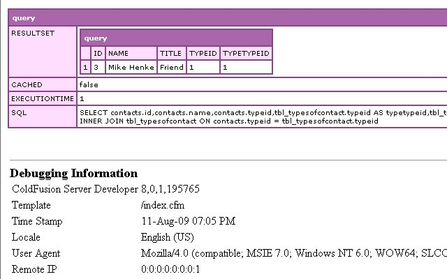
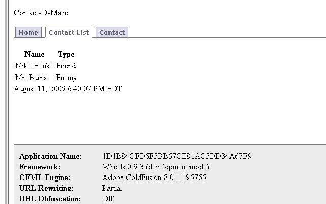

This [CFWheels](http://cfwheels.org/) series is heavy borrowed from [Dan Wilson](http://www.nodans.com/)'s "So You Want to" series about [Model Glue](http://www.model-glue.com/):Unity and matches to this [post](http://www.nodans.com/index.cfm/2007/1/26/So-you-want-to-create-a-ModelGlueUnity-application--Part-5-. "post") Previously in this series, we [installed CFWheels](http://mikehenke.com/post.cfm/so-you-want-to-install-cfwheels), [discussed some concepts](http://mikehenke.com/post.cfm/so-you-want-to-create-a-cfwheels-application-part-1 "discussed some concepts") in CFWheels, [added our basic flow](http://mikehenke.com/post.cfm/so-you-want-to-create-a-cfwheels-application-part-2) and navigation, created [add and list functionality](http://mikehenke.com/post.cfm/so-you-want-to-create-a-cfwheels-application-part-3 "add and list our contacts"), and [validation](http://mikehenke.com/post.cfm/so-you-want-to-create-a-cfwheels-application-part-4 "validation") to our Contact-O-Matic Application. Next in the series, we will cover the built in ORM of CFWheels. An [Object Relation Mapper](http://en.wikipedia.org/wiki/Object-relational_mapping "orm") (ORM) is used to translate between our [Relational Database](http://en.wikipedia.org/wiki/Relational_Database "Relational Database") and our [Object Oriented programming](http://en.wikipedia.org/wiki/Object_oriented_programming "Object Oriented programming"). One nice thing, it is simplifies common [sql](http://en.wikipedia.org/wiki/SQL "sql") statements thus saving us time and reducing sql errors. More complex SQL will still need to be coded. Don't think you won't have to learn SQL, the ORM can't do everything better but it will make the mundane tasks simplier.

### CFWheel ORM

I glossed over some important convention before in our series. CFWheels expects the table name to be plural like contacts, a primary keys in the tables, and the primary key column to be name id. Our Contacts table meets all these. We can override the table name and primary key column name but CFWheels does need a primary key.

### Database Code

Lets drop our old table and create it along with a types table using this code. \[code language="coldfusion"\]DROP TABLE IF EXISTS contactomatic.contacts; CREATE TABLE 'contactomatic'.'contacts' ( 'id' INTEGER UNSIGNED NOT NULL AUTO\_INCREMENT, 'name' VARCHAR(45) NOT NULL, 'typeid' INTEGER UNSIGNED NOT NULL, PRIMARY KEY ('id') ) ENGINE = InnoDB;\[/code\] \[code language="coldfusion"\]DROP TABLE IF EXISTS contactomatic.tbl\_typesofcontact; CREATE TABLE 'contactomatic'.'tbl\_typesofcontact' ( 'typeid' INTEGER UNSIGNED NOT NULL AUTO\_INCREMENT, 'title\_for\_type\_of\_contact' VARCHAR(45) NOT NULL, PRIMARY KEY ('typeid') ) ENGINE = InnoDB;\[/code\] \[code language="coldfusion"\]INSERT INTO contactomatic.tbl\_typesofcontact (title\_for\_type\_of\_contact) VALUES('Friend');\[/code\] \[code language="coldfusion"\]INSERT INTO contactomatic.tbl\_typesofcontact (title\_for\_type\_of\_contact) VALUES('Enemy');\[/code\] \[code language="coldfusion"\]INSERT INTO contactomatic.tbl\_typesofcontact (title\_for\_type\_of\_contact) VALUES('Co-Worker');\[/code\]

### Types Model

In our /controller/contact.cfc add this code to the \[code language="coldfusion"\]new\[/code\] action. \[code language="coldfusion"\]\[/code\] While we are in this file, replace the code in the list action with this: \[code language="coldfusion"\] \[/code\] And now lets check our add form. \[code language="coldfusion"\]URL Rewriting On = http://localhost/contact/new?reload=true\[/code\] \[code language="coldfusion"\]URL Rewriting Partial = http://localhost/index.cfm/contact/new?reload=true\[/code\] \[code language="coldfusion"\]URL Rewriting Off = http://localhost/index.cfm?controller=contact&action=new\[/code\] 

### Table Naming

Well, you can see CFWheels assumes we have a types table since our newly created model cfc's name is type. Our table's name is actually tbl\_typesofcontact, we could rename the cfc to tbl\_typesofcontact.cfc, but CFWheels convention also says our table name should be plural. Lets tell (configure) CFWheels we already have a table name that doesn't fit in CFWheel's conventions. Add this code to our type.cfc in the models folder. \[code language="coldfusion"\] \[/code\] ÿ As you can see, we tell CFWheels our table's actual name. Also we give the long column name, title\_for\_type\_of\_contact, a shorter name, title. See how easy it is to override CFWheel's table conventions. It would have been easier if initially our table was named contacttypes and the model cfc contacttype.cfc but sometimes this won't be an option. Reload our page and you should now see our old form but look @ our debug information  Notice we have a new query. This was created by the code, \[code language="coldfusion"\]\[/code\], we added to our \[code language="coldfusion"\]new\[/code\] action in /controllers/contact.cfc.

### Select Helper

Lets add our select box populated from this query to our form using a CFWheels helper. Replace in /view/new.cfm \[code language="coldfusion"\]

#textField(objectName="newContact", property="type", label="Type")#

\[/code\] With \[code language="coldfusion"\]

#select(objectName="newContact", property="typeid", options=types, label="Type", includeBlank="")#

\[/code\] The select helper takes our blank new object, the typeid column (property), the types object, and we add a label of Type. For more information on Helper Forms, look through the code in \\wheels\\view\\forms.cfm. Load the page again, and now you should see the select dop down box. Lets submit the form.  Weird, we selected a valid contact type from our new select drop down box, but our validation is catching it. This is because the value the form is submitting is actually the typeid not the title. Well, lets change our validation and add an association to mark typeid as a foreign key. In our model/contact.cfc change the code to match this. \[code language="coldfusion"\] \[/code\] We basically made sure the typeid is present instead of type and declared a datebase relationship (association). Following CFWheels convention, we could use \[code language="coldfusion"\]\[/code\] if we followed our CFWheels naming convention for the primary key of a table but instead of id, we have typeid so we need to tell CFWheels. Lets try to submit the form again.  We are making progress, looks like the form submitted and executed our cfdump and cfabort in /controllers/contact.cfc

### Association

Here is where our association we set in /models/contact.cfc comes to play. CFWheels ORM joins the tbl\_typesofcontact table with the contacts table. This happens because we added the association declaring the foriegn key in our /models/contacts.cfc and in creating the query, we told it to include type. \[code language="coldfusion"\]\[/code\] Remove \[code language="coldfusion"\]\[/code\] from /controllers/contact.cfc in the list action and reload our list. \[code language="coldfusion"\]URL Rewriting On = http://localhost/contact/list?reload=true\[/code\] \[code language="coldfusion"\]URL Rewriting Partial = http://localhost/index.cfm/contact/list?reload=true\[/code\] \[code language="coldfusion"\]URL Rewriting Off = http://localhost/index.cfm?controller=contact&action=list&reload=true\[/code\]  More on [Associations](http://cfwheels.org/docs/chapter/associations) We did alot of work with the built in ORM. You did a good job. Next post, we will cover the return differences between some built in ORM calls and the logic why, how to specify the return columns, specify the where clause, and create advance queries. Hopefully after that, we will cover editing and deleting records.
