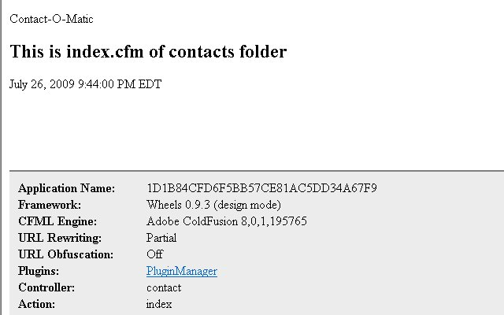
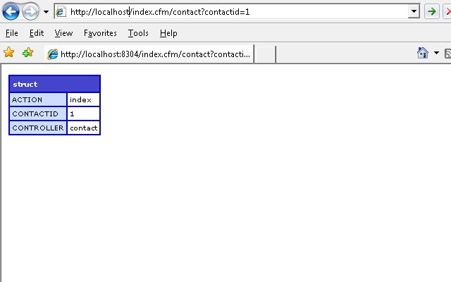
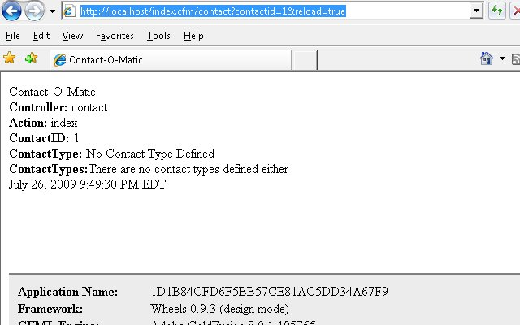
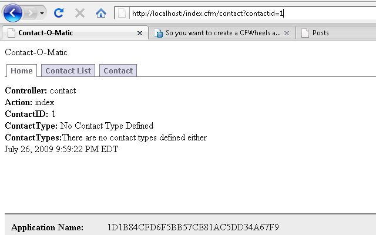

This [CFWheels](http://cfwheels.org) series is heavily borrowed from [Dan Wilson](http://www.nodans.com/ "Dan Wilson")'s "So You Want to" series about [Model Glue](http://www.model-glue.com/ "Model Glue"):Unity. This entry matches to [this post](http://www.nodans.com/index.cfm/2007/1/21/So-you-want-to-build-a-Model-Glue-Application-Part-2 "this post"). We have [installed](/post.cfm/so-you-want-to-install-cfwheels "installed") CFWheels and [talked about the files, Request Handling and URL Rewriting](/post.cfm/so-you-want-to-create-a-cfwheels-application-part-1 "talked about the files installed, Request Handling and URL Rewriting"). If you setup [URL Rewriting](http://cfwheels.org/docs/chapter/url-rewriting "URL Rewriting"), you will be accessing our Contacts application a little differently then if you have partial URL rewriting or no URL rewriting. I'll show all three URLs.

### View

First, lets create a folder under views called contact, then inside it create index.cfm. Place this code in index.cfm \[code language="coldfusion"\] Contact-O-Matic 

Contact-O-Matic

## This is index.cfm from contact folder

#dateformat( now(), "long")# #timeformat( now(), "long")#

\[/code\] Check our page now, depending on your setup use one of these: \[code language="coldfusion"\] URL Rewriting On = http://localhost/contact URL Rewriting Partial = http://localhost/index.cfm/contact URL Rewriting Off = http://localhost/index.cfm?controller=contact&action=index \[/code\] You should see this:  At the bottom section of the browser, you can see some specific CFWheels debugging information. Notice the controller is contact and the action is index.

### Controller and Action

Let's add the controller and action. Create a contact.cfc file in the Controller folder with this code. \[code language="coldfusion"\] \[/code\] Add the url variable \[code language="coldfusion"\]customerid=1\[/code\] to your URL and run the page. \[code language="coldfusion"\] URL Rewriting On = http://localhost/contact?contactid=1 \[/code\] \[code language="coldfusion"\] URL Rewriting Partial = http://localhost/index.cfm/contact?contactid=1 \[/code\] \[code language="coldfusion"\] URL Rewriting Off = http://localhost/index.cfm?controller=contact&action=index&contactid=1\[/code\] You should see the contents of the params struct. This structure helps you by combining form and url scopes in one place. The params structure can be accessed in the view and controller, but not the model. Notice the params structure also has the action and controller named.  Remove the dump and abort from the index action in the contact controller. Place the following two lines of code in the action. \[code language="coldfusion"\] \[/code\]

### View again

Then in the views folder, replace \[code language="coldfusion"\]

## This is index.cfm from contact folder

\[/code\] in index.cfm with this: \[code language="coldfusion"\] **Controller:** #params.Controller#  
**\[/code\] \[code language="coldfusion"\] Action:** #params.Action#  
\[/code\] \[code language="coldfusion"\] **ContactID:** #params.ContactID#  
\[/code\] \[code language="coldfusion"\] **ContactType:** #variables.ContactType#  
\[/code\] \[code language="coldfusion"\] **ContactTypes:**#variables.ContactTypes# \[/code\] Refresh the page, you should see this.  Notice, the ContactType and ContactTypes variable we set in the controller are available in the variables scope of our view.

### Layouts

We have covered alot, but two more things. You may have noticed our source has two html and body tags. This is because, CFWheels has a [layout convention](http://cfwheels.org/docs/chapter/using-layouts). This file is in view/layout.cfm. Let's move our common header and footer code to it. Change the default layout page so it looks like this: \[code language="coldfusion"\] Contact-O-Matic 

#contentForLayout()#

#dateformat( now(), "long")# #timeformat( now(), "long")#

\[/code\] The views/contact/index.cfm file should now only contain this: \[code language="coldfusion"\]

**Controller:** #params.Controller#  
**Action:** #params.Action#  
**ContactID:** #params.ContactID#  
**ContactType:** #variables.ContactType#  
**ContactTypes:**#variables.ContactTypes#  

\[/code\]

### Partials

There much cleaner. One last thing. Lets add a menu by creating a partial. [Partials](http://cfwheels.org/docs/chapter/partials) are like using a cfinclude but more powerful within CFWheels. Create a file in the views/contact folder called \_banner.cfm . The underline is a convention for signifying a partial file. Put this code in the \_banner.cfm file: \[code language="coldfusion"\]

Contact-O-Matic

- [id="current">Home](#)
- [id="current">Contact List](#)
- [id="current">Contact](#)

\[/code\] In views/contact/index.cfm add this after the openning cfoutput tag: \[code language="coldfusion"\]#includePartial("banner")#\[/code\]

### StyleSheet

Add a menu.css file using the css from [listamatic](http://css.maxdesign.com.au/listamatic/horizontal05.htm) into the stylesheets folder. And Voila. You should have something like this now.  In the next part of our series, we will add and save contacts with a contact form.
