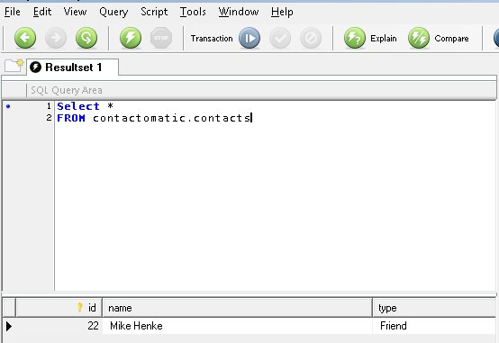
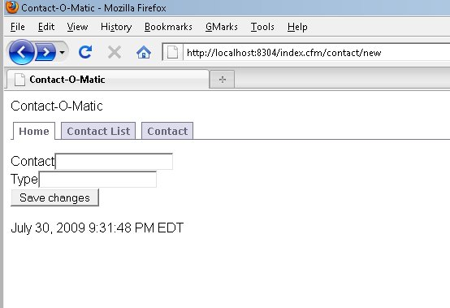
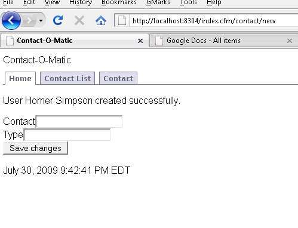
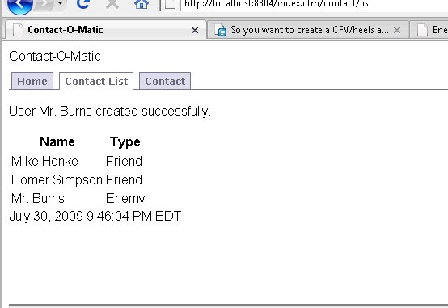

This [CFWheels](http://cfwheels.org/) series is heavily borrowed from [Dan Wilson](http://www.nodans.com)'s "So You Want to" series about [Model Glue](http://model-glue.com):Unity.  This entry matches to this [post](http://www.nodans.com/index.cfm/2007/1/21/So-you-want-to-create-a-ModelGlueUnity-application--Part-3-). Previously in this series, we [installed CFWheels](http://mikehenke.com/post.cfm/so-you-want-to-install-cfwheels), [discussed some basic conventions over configuration and concepts](http://mikehenke.com/post.cfm/so-you-want-to-create-a-cfwheels-application-part-1) in CFWheels, and [added our basic flow and navigation](http://mikehenke.com/post.cfm/so-you-want-to-create-a-cfwheels-application-part-2). Our Contact-O-Matic is moving right along (this last sentence was borrowed from Dan's post.) In this segment of our regularly scheduled programming (again borrowed), we will setup a Contactomatic database with tables, add the contact form, and contact list.

### Database Setup

CFWheels 0.9.3 supports SQL Server 7 or later, Oracle 10g or later, PostgreSQL, and MySQL 5. You will need to setup a database and a simple table. Here is my code for MySQL 5. _Please post your creation code in the comments if you are using a different database system._ \[code language="coldfusion"\] DROP TABLE IF EXISTS 'contactomatic'.'contacts'; CREATE TABLE 'contactomatic'.'contacts' ( 'id' int(10) unsigned NOT NULL AUTO\_INCREMENT, 'name' varchar(45) NOT NULL, 'type' varchar(45) NOT NULL, PRIMARY KEY ('id') ) ENGINE=InnoDB AUTO\_INCREMENT=22 DEFAULT CHARSET=latin1; \[/code\] Add a datasource called "contactomatic" to our new database through the ColdFusion Administrator

### Config

CFWheels simplifies alot of time consuming steps we have gotten use to in developing ColdFusion application using conventions (or assumptions) of our database and naming.  Don't worry, we can override these assumptions/conventions if needed. Our first convention we encounter in CFWheels assumes our datasource name is the same as the webroot folder name. We will override that in config/development/settings.cfm . Place this code in that file. \[code language="coldfusion"\] \[/code\] More on [configuration and defaults](http://cfwheels.org/docs/chapter/configuration-and-defaults).

### Environment

We will make sure our CFWheels environment is pointing to development. Check the enviroment.cfm file in the config folder has this. \[code language="coldfusion"\] \[/code\] More on [switching environments](http://cfwheels.org/docs/chapter/configuration-and-defaults).

### Model

The Model folder is where we will create cfc files that map to tables. One cfc per table. Since we created a contact table, we will create a contact.cfc and place this code in it: \[code language="coldfusion"\] \[/code\]

### New Action

We will add the new action in our contact.cfc file in the controller. Add this code to in the Controllers/contact.cfc . \[code language="coldfusion"\] \[/code\] And run the page, remember your URL maybe different depending on your URL Rewriting setting. \[code language="coldfusion"\] URL Rewriting On = http://localhost/contact/new \[/code\] \[code language="coldfusion"\] URL Rewriting Partial = http://localhost/index.cfm/contact/new \[/code\] \[code language="coldfusion"\] URL Rewriting Off = http://localhost/index.cfm?controller=contact&action=new \[/code\] You should see nothing in the browser but check our contacts table. \[code language="coldfusion"\] select \* from contacts \[/code\]  Pretty neat, look mamma no SQL!!! What we did was create an object called newContact to represent our Contact table, then added properties that map to our columns.

### Create View

Lets drive on and create the new view page.  It will have a form to add new contacts, but before we do that let's modify the new action by commenting out this code. \[code language="coldfusion"\] \[/code\] Now lets add new.cfm in the Views folder and place this code in it. \[code language="coldfusion"\] #includePartial("banner")# #flash("success")# #startFormTag(action="create")#

#textField(objectName="newContact", property="name", label="Contact")#

#textField(objectName="newContact", property="type", label="Type")#

#submitTag()#

#endFormTag()# \[/code\] You may remember the \[code language="coldfusion"\]includePartial\[/code\] from [Part 2](http://mikehenke.com/post.cfm/so-you-want-to-create-a-cfwheels-application-part-2). It acts a cfinclude with special powers. We added our banner for navigation this way. The rest of the code looks like ColdFusion functions. They are actually CFWheels Helpers. \[code language="coldfusion"\]startFormTag()\[/code\] starts the form tag with an action of create. Pretty intuitive, huh. Take a guess on what \[code language="coldfusion"\]textField()\[/code\] does. Bingo. It creates a text field. You can figure out the rest hopefully :-) \[code language="coldfusion"\]textField()\[/code\] takes the blank newContact object we created in new action and matches the property (column name) and gives it a label. Run the page and you should see this. \[code language="coldfusion"\] URL Rewriting On = http://localhost/contact/new URL Rewriting Partial = http://localhost/index.cfm/contact/new URL Rewriting Off = http://localhost/index.cfm?controller=contact&action=new \[/code\] 

### Adding Create Action

Lets add the create action in controllers/contact.cfc . Add this code: \[code language="coldfusion"\] #includePartial("banner")# #flash("success")# #startFormTag(action="create")#

#textField(objectName="newContact", property="name", label="Contact")#

#textField(objectName="newContact", property="type", label="Type")#

#submitTag()#

#endFormTag()# \[/code\] Enter some data into our form and submit it.  Delete \[code language="coldfusion"\]\[/code\] and uncomment \[code language="coldfusion"\]\[/code\] in our create action.

### List

Lets create our list action and view, then take a break and get a drink. We will go more indepth what we did in the next posts. Add this code in controllers/contract.cfc, it creates the sql and get a list of our contacts. \[code language="coldfusion"\] \[/code\] Add list.cfm in the views/contact folder with this code: \[code language="coldfusion"\] #includePartial("banner")# #flash("success")# \-No Saved Contacts- 

| Name | Type |
| --- | --- |
| #allContacts.name# | #allContacts.type# |

\[/code\] Add another contact and you should now see something like this.  By now, you should have an appreciation for what CFWheels can do. You should be very impressed by the power of built in ORM and Conventions over Configuration. You should be proud of yourself for making it through these verbose tutorials. In the following series, we will add database access, some ajax and some other interesting pieces to our Contact-O-Matic (again this paragraph was borrowed heavy from Dan's post)
