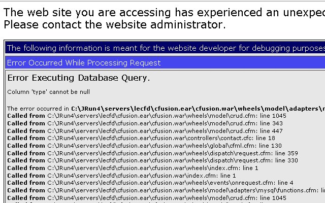
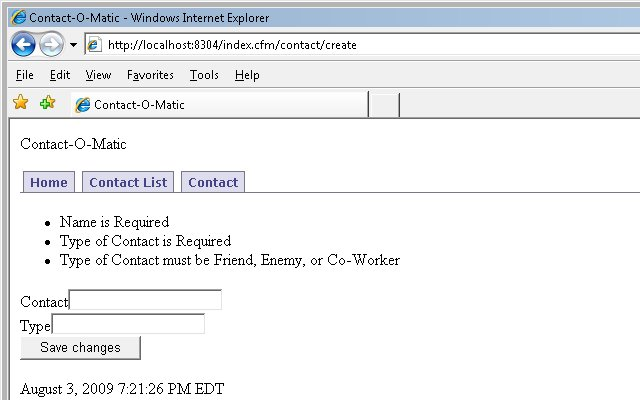
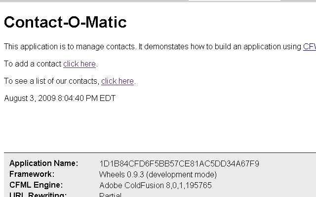
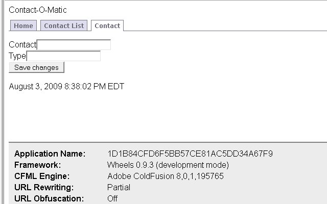

This [CFWheels](http://cfwheels.org/) series is heavily borrowed from [Dan Wilson](http://www.nodans.com/)'s "So You Want to" series about [Model Glue](http://www.model-glue.com/):Unity. This entry matches to this [post](http://www.nodans.com/index.cfm/2007/1/22/So-you-want-to-create-a-ModelGlueUnity-application--Part-4-). Previously in this series, we [installed CFWheels](/so-you-want-to-install-cfwheels), [discussed some basic conventions and concepts](/so-you-want-to-create-a-cfwheels-application-part-1) in CFWheels, [added our basic flow and navigation](/so-you-want-to-create-a-cfwheels-application-part-2), and most recently created [add and list functionality](/so-you-want-to-create-a-cfwheels-application-part-3 "add and list our contacts") to our contacts. Our Contact-O-Matic is moving right along (this last sentence was borrowed from Dan's post.) In the last segment, we tested the 'success' path and were routed to the contact list. Now let's try the 'failure' path, add some validation, and refactor our code. Remember to get our form, we will use one of these URLs depending on the [URL Rewriting](http://cfwheels.org/docs/chapter/url-rewriting "URL Rewriting") you setup. \[code language="coldfusion"\]
URL Rewriting On = http://localhost/contact/new
\\[/code\]  
\[code language="coldfusion"\]
URL Rewriting Partial = http://localhost/index.cfm/contact/new
\\[/code\]  
\[code language="coldfusion"\]
URL Rewriting Off = http://localhost/index.cfm?controller=contact&action=new
\\[/code\] So what happens if we submit a blank form? 

### Validation

D'oh, so we need some validation apparently. Luckily for us, we are learning CFWheels which has built in validation to help us with saves, creates, and updates. In our model cfc of the contacts table, located at Models/contact.cfc, add this code: \[code language="coldfusion"\]
<cffunction name="init">
<cfset validatesPresenceOf(property="name",message="Name is Required") />
<cfset validatesPresenceOf(property="type",message="Type of Contact is Required") />
<cfset validatesUniquenessOf(property="name", message="Name is already present") />
<cfset validatesInclusionOf(property="type",list="Friend,Enemy,Co-Worker",message="Type of Contact must be Friend, Enemy, or Co-Worker") />
</cffunction>
\\[/code\] By now you can see CFWheels is pretty intuitive with their naming, so validatesPresenceOf does just that, we could pass in a list of properties but for Contact-O-Matic that isn't needed. Review the file \\wheels\\model\\validations.cfm in our application for information on the different validation options. To read more about [Object Validation](http://www.cfwheels.org/docs/chapter/object-validation "Object Validation"). In /Controllers/contact.cfc replace our previous create action with this code. \[code language="coldfusion"\]
<cffunction name="create">
<cfset newContact = model("Contact").new(params.newContact)>
<cfif newContact.Save()>
<cfset flashInsert(success="User #params.newContact.name# created successfully.") />
<cfset redirectTo(action="list") />
<cfelse>
<cfset renderPage(action="new") />
</cfif>
</cffunction>
\\[/code\] Now replace \[code language="coldfusion"\]
#flash("success")#
\\[/code\] with \[code language="coldfusion"\]
#errorMessagesFor("newContact")#
\\[/code\] in /Views/new.cfm And finally lets test our failure. You should see this.  If not, add \[code language="coldfusion"\]
&reload=true
\\[/code\] to your URL. This tells CFWheels to reload the entire framework. If you are still not seeing the message, recheck our code. Some points I'd like to cover, we changed \[code language="coldfusion"\]
<cfset model("Contact").create(params.newContact)>
\\[/code\] to \[code language="coldfusion"\]
<cfset newContact = model("Contact").new(params.newContact)>
\\[/code\]. This creates a newContact object based on the contact model. Then we call the save action on it. This will return true for successful or false for unsuccessful. Based on this, we either go to the list action or show the new view which has our form. Notice with \[code language="coldfusion"\]
renderPage()
\\[/code\], the process just includes the new view page for new action. If it ran the new action code, we would have a blank form but CFWheels keeps our scope to repopulate the form on \[code language="coldfusion"\]
renderPage()
\\[/code\]. One other thing, notice our URL is now at \[code language="coldfusion"\]
http://localhost/index.cfm/contact/create
\\[/code\]. This is because our form submits to the create action since we did a \[code language="coldfusion"\]
renderPage()
\\[/code\] on false the page keeps loading and shows our error messages.

### Refactor

Now a little refactoring, you may remember we left our index action and view in a mess. Delete the index action in Controllers/contact.cfc and put this code in Views/contact/index.cfm . \[code language="coldfusion"\]
<cfoutput>

<h1>Contact-O-Matic</h1>
This application is to manage contacts. It demonstrates how to build an application using <a href="http://www.cfwheels.org">CFWheels</a>
To add a contact #linkTo(text="click here",controller="contact",action="new")#.
To see a list of our contacts, #linkTo(text="click here",controller="contact",action="list")#.
</cfoutput>
\\[/code\] And run the page, hopefully you will see the screenshot below our URL choices. \[code language="coldfusion"\]
URL Rewriting On = http://localhost/contact/
\\[/code\]  
\[code language="coldfusion"\]
URL Rewriting Partial = http://localhost/index.cfm/contact
\\[/code\]  
\[code language="coldfusion"\]
URL Rewriting Off = http://localhost/index.cfm?controller=contact&action=index
\\[/code\]  You maybe wondering how this worked since we deleted the index action in Controller/contacts.cfc. CFWheels convention allows this. It knows to get the view without a controller defined. The \[code language="coldfusion"\]
linkto()
\\[/code\] is a CFWheels helper. It should create the correct link for CFWheels based on your URL Rewrite. More on the [Linking Pages](http://cfwheels.org/docs/chapter/linking-pages "Linking Pages").

### More Refactoring

You may have noticed our navigation wasn't working, we created a [Partial](http://cfwheels.org/docs/chapter/partials "Partial") called \_Banner.cfm and placed it in the Views/contact/ folder. Replace the current code with this \[code language="coldfusion"\]
<cfoutput>

Contact-O-Matic
<ul id="navlist">
<li <cfif params.action IS "home">id="current"</cfif> >#linkTo(text="Home",controller="contact",action="index")#</li>
<li <cfif params.action IS "list">id="current"</cfif>>#linkTo(text="Contact List",controller="contact",action="list")#</li>
<li <cfif ListContains("new,create", params.action)>id="current"</cfif> >#linkTo(text="Contact",controller="contact",action="new")#</li>
</ul>

</cfoutput>
\\[/code\] And last thing for today, change menu.css in the stylesheets folder. Replace this code \[code language="coldfusion"\]
#navlist li a
{
background: white;
border-bottom: 1px solid white;
}
\\[/code\] with this code \[code language="coldfusion"\]
#navlist #current a
{
background: white;
border-bottom: 1px solid white;
}
\\[/code\] Now the menu banner should be working fine.  Go ahead, add some contacts to our Contact-O-Matic, make sure our validation is working, and the links. Pat yourself on the back, you have done a good job. Next time in the series, we will cover the ORM in more detail, adding an update and delete page, and contact type table.
