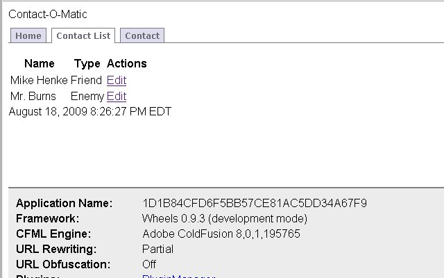
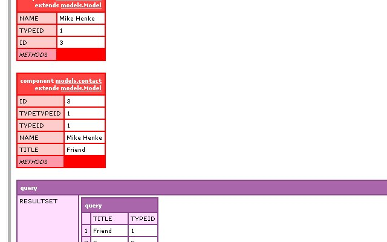
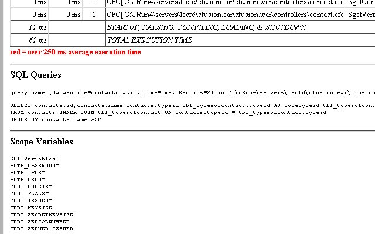
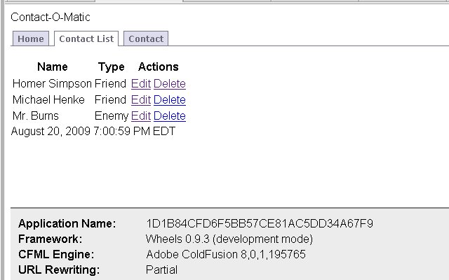

This [CFWheels](http://cfwheels.org/) series is heavily borrowed from [Dan Wilson](http://www.nodans.com/)'s "So You Want to" series about [Model Glue](http://www.model-glue.com/):Unity and matches to this [post](http://www.nodans.com/index.cfm/2007/2/4/So-you-want-to-create-a-ModelGlueUnity-application--Part-6- "post"). Previously in this series, we [installed CFWheels](/so-you-want-to-install-cfwheels), discussed [some concepts in CFWheels](/so-you-want-to-create-a-cfwheels-application-part-1), added [our basic flow and navigation](/so-you-want-to-create-a-cfwheels-application-part-2), created [add and list functionality](/so-you-want-to-create-a-cfwheels-application-part-3), added [validation](/so-you-want-to-create-a-cfwheels-application-part-4), and talked in [more detail about the CFWheels ORM.](/so-you-want-to-create-a-cfwheels-application-5) Here is a [zip](http://mikehenke.com/assets/content//SoYouWantToCFWheels.zip), if you want to start from this post. Unzip it in an empty webroot. Today, we will cover the CFWheels ORM a little more. Specifically the return differences between some built in ORM calls and the logic why, specify the SQL order by clause and other sql fine-tuning, and build update and delete functionality. Let's create an edit action in /Models/contact.cfc: \[code language="coldfusion"\]
<cffunction name="edit">
<cfset newContact = model("contact").findByKey(key=params.key, include="type")>
<cfset newContact1 = model("contact").findOne(where="id=#params.key#", include="type")>
<cfset types = model("type").findAll() />

<cfdump var="#newContact1#"> 
<cfdump var="#newContact#"> 
<cfdump var="#types#">
<cfabort>
</cffunction>
\\[/code\] Now add this \[code language="coldfusion"\]

<th>Actions<th>
\\[/code\] to the end of the first tr tag. And add this code to to the end of our last tr tag.\[code language="coldfusion"\]
<td>#linkTo(text="Edit", action="edit", key=allContacts.id)#</td>
\\[/code\] in \\views\\list.cfm. \\views\\list.cfm should look like this now. \[code language="coldfusion"\]
URL Rewriting On = http://localhost/contact/list
\\[/code\] \[code language="coldfusion"\]
URL Rewriting Partial = http://localhost/index.cfm/contact/list
\\[/code\] \[code language="coldfusion"\]
URL Rewriting Off = http://localhost/index.cfm?controller=contact&action=list
\\[/code\]  Click on an Edit link and you should see this:  What you see here is two objects and one query. You may think this is odd since you are using the CFWheels built in ORM and you thought the ORM calls would return the same structure. I thought the same thing but when talking to Per Djurner, it made perfect sense. Here is [what he said](http://groups.google.com/group/cfwheels/browse_thread/thread/bbe87f459b7a294c/8f4a1c09a37d1814?lnk=gst&q=object+query#8f4a1c09a37d1814): "The convention is that when you are fetching a single record from the database (using findOne, findByKey etc) you will get an object back.When you are fetching multiple records you will get a query result set back. The "returnAs" argument is a way to override this convention (and it will be improved a little more before we release 1.0)." "The reasoning behind the convention is that when you are asking the database for multiple records it is likely that you intend to display them (rather than edit/delete them). In this case objects are overkill (and even more so because of the poor performance of object creation in ColdFusion)." See the CFWheels guys are always thinking. Don't be afraid to ask @ the [CFWheels Google Group](http://groups.google.com/group/cfwheels). One other thing, I would like to point out is \[code language="coldfusion"\]
<cfset newContact1 = model("contact").findOne(where="id=#params.key#", include="type")>
\\[/code\]. See how, I easily added a where clause. This get the same results as \[code language="coldfusion"\]
<cfset newContact = model("contact").findByKey(key=params.key, include="type")>
\\[/code\]. \[code language="coldfusion"\]
FindByKey()
\\[/code\], \[code language="coldfusion"\]
FindOne()
\\[/code\] and \[code language="coldfusion"\]
FindAll()
\\[/code\] accept arguments as you can see from above. We are using the where clause and include for Associations. They also accept select, order, maxRows, and a couple arguments for pagination and caching. For more [Reading Records](http://cfwheels.org/docs/chapter/reading-records). Remove from our edit action: \[code language="coldfusion"\]
<cfdump var="#newContact1#"> 
 <cfdump var="#newContact#"> 
 <cfdump var="#types#">
 <cfabort>
\\[/code\] Test our Edit link again, and then update the contact. It should update the contact and return us to the List page For more [Updating Records](http://cfwheels.org/docs/chapter/updating-records). Lets add order by to our list action in controllers/contact.cfc. Replace \[code language="coldfusion"\]
<cfset allContacts = model("contact").findAll(include="type") />
\\[/code\] with \[code language="coldfusion"\]
<cfset allContacts = model("contact").findAll(include="type",order="name") />
\\[/code\] And reload our list again.  See the SQL now has an "Order By" clause. Lets wrap this entry up by adding delete functionality. Go to /Views/list.cfm, and add \[code language="coldfusion"\]
#linkTo(text="Delete", action="delete", key=allContacts.id)#
\\[/code\] after \[code language="coldfusion"\]
#linkTo(text="Edit", action="edit", key=allContacts.id)#
\\[/code\]. In /Controllers/contact.cfc add: \[code language="coldfusion"\]
<cffunction name="delete">
 <!--- delete will return true or false depending on success --->
 <cfif model("contact").findByKey(params.key).delete()>
 <cfset flashInsert(success="Contact #params.key# was deleted.")>
 <cfelse>
 <cfset flashInsert(error="There was an error deleting the contact.")>
 </cfif>
 <cfset redirectTo(action="list")>
 </cffunction>
\\[/code\] Load our list again and you should see the delete link. Give it a try.  Success! For more [Deleting Records](http://cfwheels.org/docs/chapter/deleting-records) We have a fully working Contact-O-Matic Application. Next in the series, I'll talk about Routing and Plugins in CFWheels.
