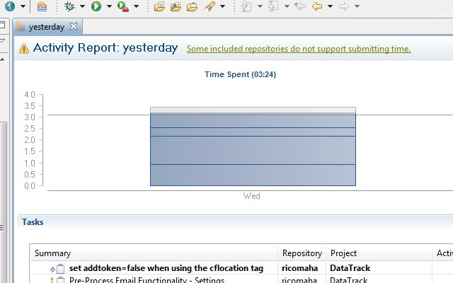
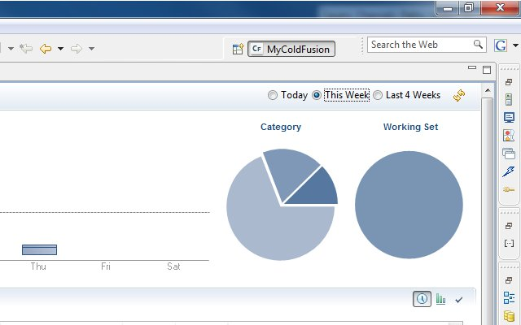
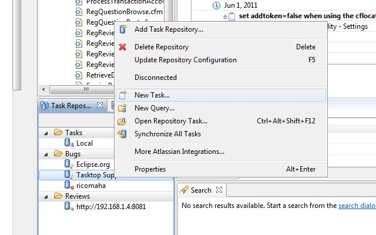

We started Agile development at my work. We are on the third sprint. Today before our standing meeting, I mentioned to a co-worker, "_I needed to figure out what I did yesterday_." If you aren't familiar with a sprint standing meeting, you need to cover three items: 1) what you did yesterday 2) what you are going to do today 3) any roadblocks I forgot I can easily use [Tasktop](http://www.tasktop.com)'s "Time Tracking Dashboard" to pull up what I did in the IDE yesterday.    Then I realized, I had to do a simple custom report for yesterday. Wouldn't it be even easier if Tasktop had a "Yesterday" radio button along with the current "Today", "This Week" and "Last 4 weeks"?  With [Mylyn](http://www.eclipse.org/mylyn/) submitting a ticket to Tasktop is a breeze. I created a new task in the Tasktop repository, filled out the ticket in my IDE and submitted it to Tasktop. **Never leaving Eclipse.** I hope [Adobe ColdFusion Builder](http://www.adobe.com/products/coldfusion-builder/features.html) and [CFEclipse](http://www.cfeclipse.org) start providing Mylyn and their task repository automatically. 
