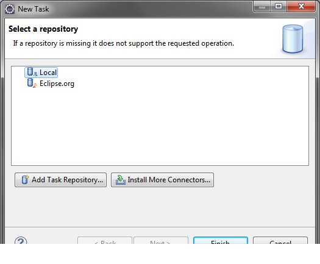
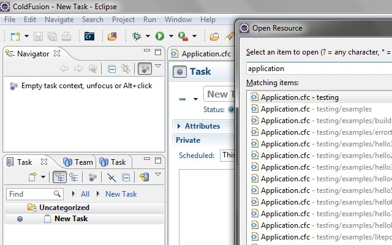
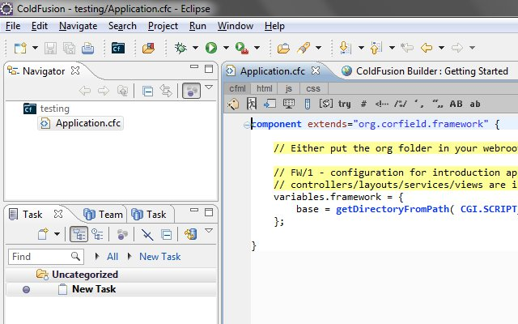
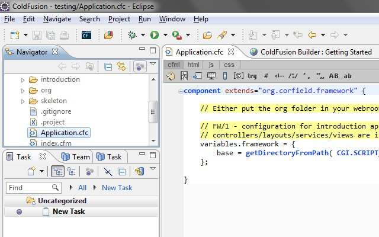
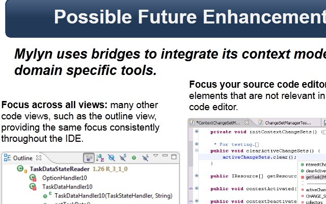

I post on [installing ColdFusion Builder 2.0.1 beta and Mylyn](http://mikehenke.com/post.cfm/coldfusion-builder-2-0-1-beta-and-mylyn). This post will show how to test it is working.

## create new local task

## active task &

## ctrl-shift-r to open resource, and type application, select application.cfc

## show Application.cfc in navigator and mylyn context

## toggle off focus on navigator view

 It seems to be working. Currently Mylyn only supports File level context support for ColdFusion Builder. In a recorded presention "[CFMeetup: Improve your workflow within ColdFusion Builder](http://experts.adobeconnect.com/p2sco3luay1/)", I have mentioned CFB could have more context enhancements. slide 23 of [presention slides](https://docs.google.com/present/edit?id=0AZZAxOdc0CBnZGMyc2I0NTRfOTA0ZjM3eGZ6bW4)  

