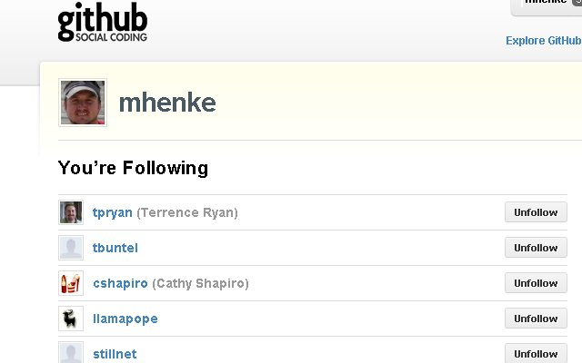
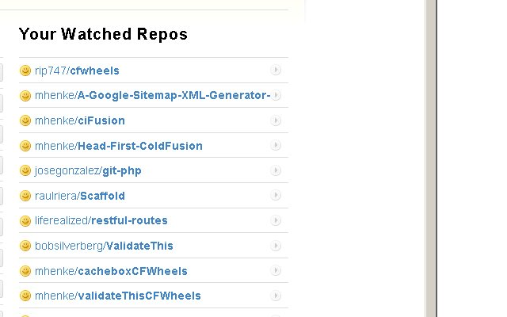

One feature of Github is "Social Coding". Github tracks users' actions (pushes, closing tickets, creating repositories) and repositories' actions allowing for people to easily see what is going on.

## You can "follow" people.

## You can "watch" repositories.

 This is cool, so you can keep tabs on all the awesome coding people are doing and even pitch in if you want. 
