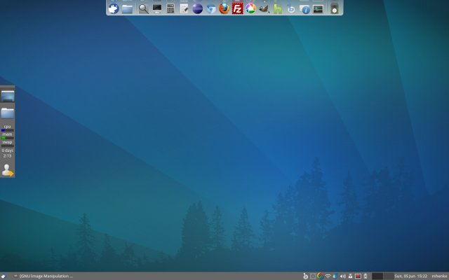

This last weekend I decided to upgrade my laptop from Vista to [Xubuntu](http://www.xubuntu.org/). I was tired of Microsoft's ever growing system bloat. I did install [Lubuntu](http://lubuntu.net/) but decided to go with Xubuntu due to some panel/toolbar issues. I use this laptop for programming, listening to podcasts, watching Hulu, Amazon Unbox, and other videos. I have multiple monitors (large monitor for videos along with the laptop screen). Here is my final laptop screen layout. 

## Application

Applications I need to bring over from Windows were:

- Gimp
- Filezilla
- Firefox
- Chrome (using Chromium now)
- OpenOffice (using LibreOffice now)
- Eclipse
- Picasa
- Hulu Desktop
- Google Desktop
- Amazon Unbox (no linux version)

## Lightweight solution

I'll list Xubutun's current (11.04) requirements and then show Window's ever growing minimual requirements from Vista to Windows 7. My system is 2 @ 2 gigahertz processors, 6 gigabyte RAM, and 320 gigabyte disk space.

## Xubuntu system requirements

If you want to run Xubuntu on your PC, here's what it takes:

- 700 megahertz x86 processor
- 192 megabyte RAM, but 256 MB RAM is strongly recommended
- 2GB gigabyte disk space

[https://help.ubuntu.com/community/Installation/SystemRequirements](https://help.ubuntu.com/community/Installation/SystemRequirements)

## Windows XP system requirements

If you want to run Windows XP on your PC, here's what it takes:

- 300 megahertz processor
- 64 megabytes (MB) of RAM (128 MB is recommended)
- 1.5 gigabytes disk space

## Windows Vista system requirements

If you want to run Windows Vista on your PC, here's what it takes:

- 1 gigahertz processor
- 1 gigabyte RAM
- 40 gigabyte hard drive with at least 15 gigabyte

## Windows 7 system requirements

If you want to run Windows 7 on your PC, here's what it takes:

- 1 gigahertz processor
- 1 (32-bit) or 2 (64-bit) gigabyte RAM
- 16 (32-bit) or 20 GB (64-bit) gigabyte available hard disk space

Next post will be about the Linux applications I found and installed for screenshots, backup, tweaks, media, and video player. I'll talk about some some items I changed from the default Xubuntu instance like terminal and the file explorer to lighter alternatives.
