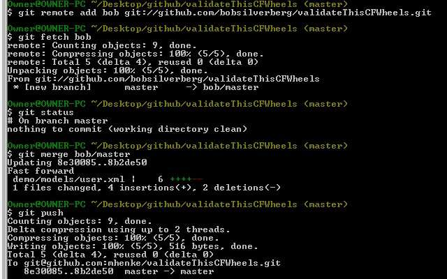

I have been touting [Github](http://github.com) for ColdFusion open source projects. I have a great example of why. [Bob Silverberg](http://www.silverwareconsulting.com/) has been working on ValidateThis for Wheels. This consists of two projects, the [ValidateThis framework](http://github.com/bobsilverberg/ValidateThis) and a [ValidateThis Wheels plugin](http://github.com/mhenke/validateThisCFWheels). He [forked](http://help.github.com/forking/) my repository of the plugin and [made a change](http://github.com/bobsilverberg/validateThisCFWheels/commit/8b2de50d1ac6b348e9503e20a7d2da1d6d09a0f0), then sent me a pull request. All I had to do was add Bob's remote branch to my local repository, fetch the changes, then merge in the changes, and push the update. Notice I didn't change from my branch.  I found the [commands here](http://support.github.com/discussions/repos/2131-apply-fork-changes).  
git remote add bob git://github.com/bobsilverberg/validateThisCFWheels.git  
git fetch bob  
git merge bob/master  
git push
