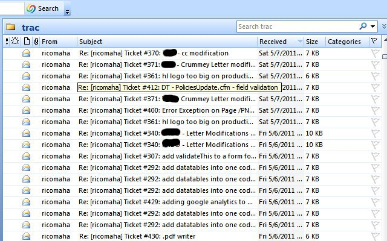
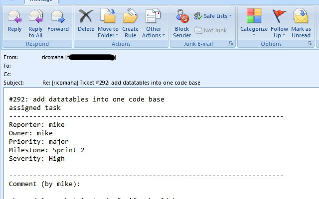
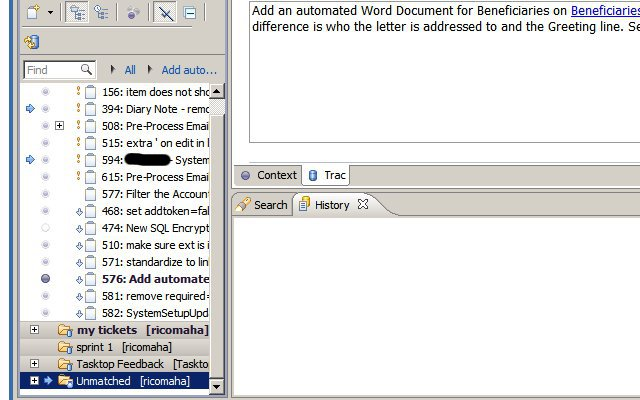
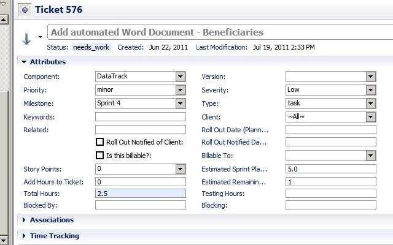

I was prep-ing for a [Mylyn / Tasktop presentation](https://docs.google.com/present/view?id=dc2sb454_768dchktjgc) in Kansas City at [D2WC](http://d2wc.com/). My mom was visiting and we were in the living room watching a short presentation on [Mylyn](http://www.eclipse.org/mylyn/). My mom, a retired grade school teacher, kind of jumped forward in her seat and exclaimed "That is very useful". The feature she instantly understood the benefit of, I will be demonstrate in this post. It is how Mylyn helps you turn off ticket update emails and within your IDE you can easily see ticket updates and what changed. This first screenshot is a typical inbox full of ticket updates. It is not very useful. Every subject is repetitive and you don't know what is important or what changed easily.  The second screenshot is one of the ticket update emails. Still not very useful.  Now let's compare Mylyn. Here is a screen shot of my task list in the IDE. You can easily see which tickets have incoming changes based on the blue arrow.  If you click on a task with a blue arrow, the task opens in my IDE and changes appear highlighted in blue.  Hopefully, now like my mom, you know a great reason to use Mylyn and this is just one example of many.
