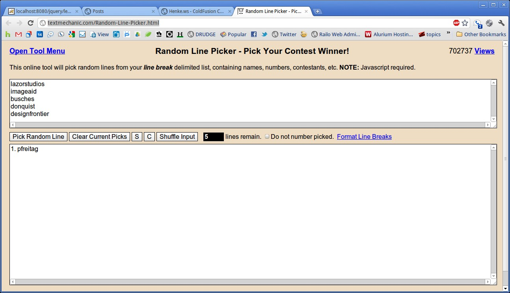

Last week, I [announced a contest](http://mikehenke.com/post.cfm/contribute-win-a-chance-for-object-oriented-programming) for a lucky contributor of "[CFML in 100 minutes](https://github.com/mhenke/CFML-in-100-minutes)". The contest was an outstanding success. There were great contributions from simple to more complex. I used a [Random Line Picker](http://textmechanic.com/Random-Line-Picker.html) to shuffle the contributors from alpahbetic order 5 times, then selected "pick random line". 
