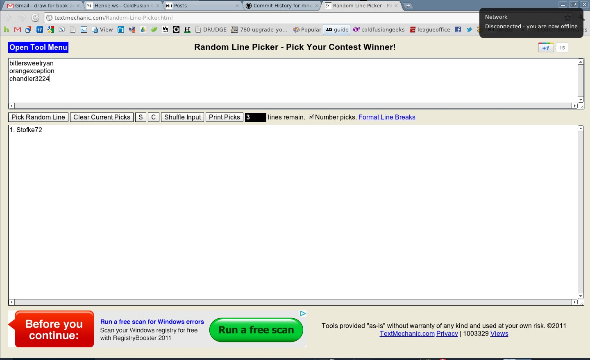

Couple weeks ago, I [announced a contest](/contribute-to-cfml-in-100-mins-and-win-head-first-jquery-book) for a lucky contributor of "[CFML in 100 minutes](https://github.com/mhenke/CFML-in-100-minutes)". The contest was an good success. We had 4 contributors I used a [Random Line Picker](http://textmechanic.com/Random-Line-Picker.html) to shuffle the contributors from alpahbetic order 5 times, then selected "pick random line". If the winner doesn't want the book, I will re-do the selection process.

# Stofke72

